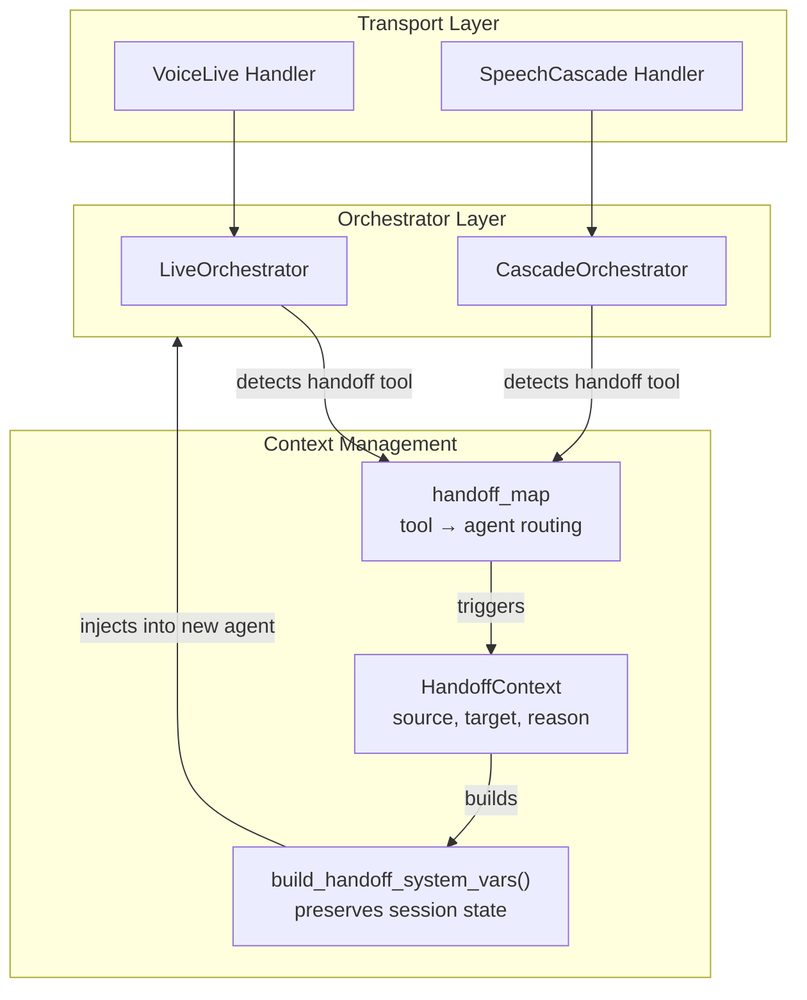
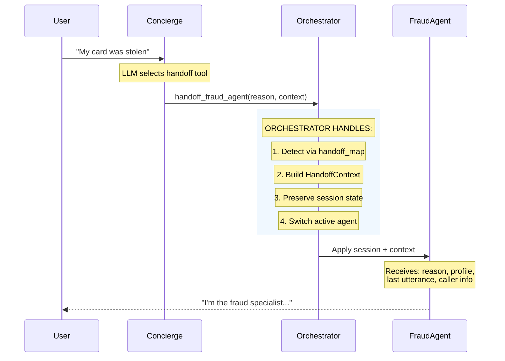
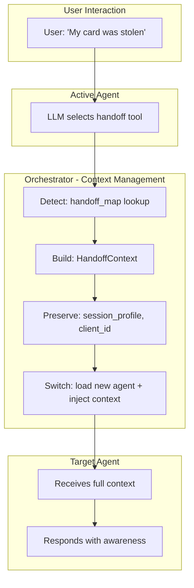
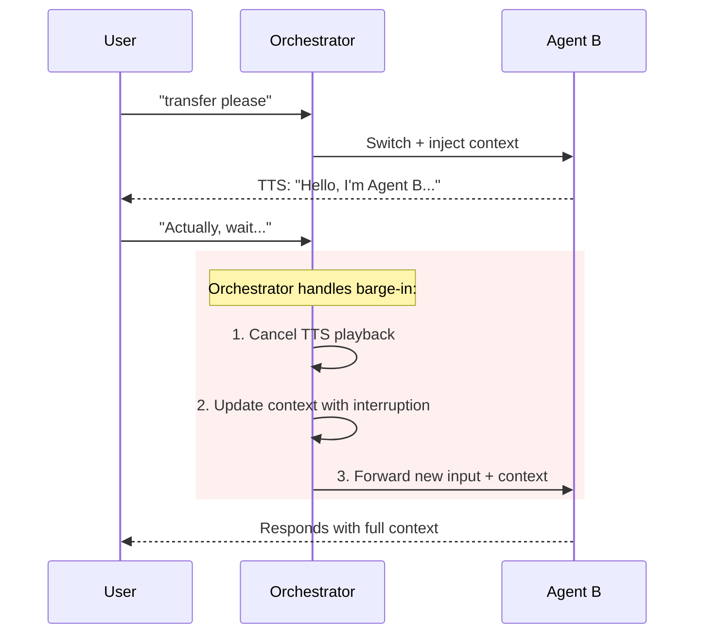
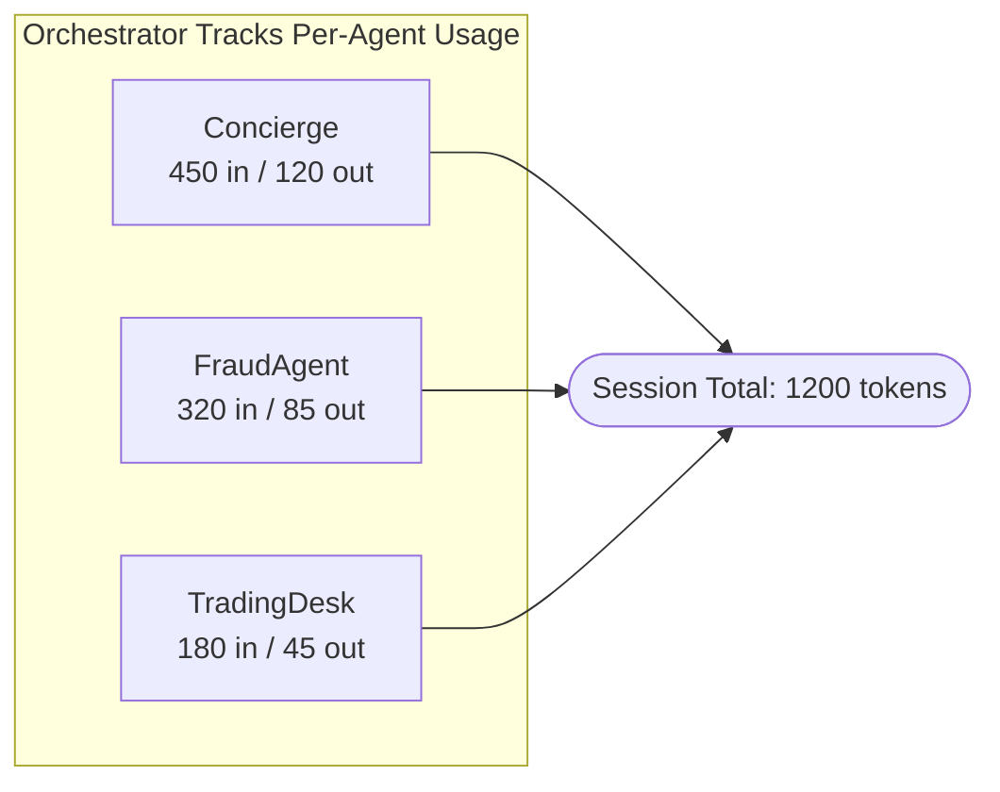

# Agent Handoff Strategies

> **Navigation**: [Architecture](../README.md) | [Orchestration](../orchestration/README.md) | [Agent Framework](README.md)

This document explains the **agent handoff system** in the ART Voice Agent Accelerator—how specialized agents transfer conversations to each other seamlessly across both orchestrator modes.

---

## Table of Contents

1. [Overview](#overview)
2. [Architecture Diagram](#architecture-diagram)
3. [Handoff Mechanisms](#handoff-mechanisms)
   - [Tool-Based Handoffs](#tool-based-handoffs)
   - [Handoff Map (Dynamic Discovery)](#handoff-map-dynamic-discovery)
4. [Orchestrator Integration](#orchestrator-integration)
5. [Flow Diagrams](#flow-diagrams)
6. [Implementation Guide](#implementation-guide)
7. [Configuration Reference](#configuration-reference)

---

## Overview

In multi-agent voice systems, **handoffs** allow specialized agents to transfer conversations to each other. For example:
- A concierge agent (`EricaConcierge`) might transfer to a fraud specialist (`FraudAgent`)
- An investment advisor might escalate to compliance (`ComplianceDesk`)

The handoff system uses **tool-based detection** with a **dynamically-built handoff map**:

| Component | Purpose | Location |
|-----------|---------|----------|
| **`build_handoff_map()`** | Builds tool_name→agent_name map from YAML | `agents/loader.py` |
| **`is_handoff_tool()`** | Checks if a tool triggers agent switch | `agents/tools/registry.py` |
| **`HandoffContext`** | Context data passed during transitions | `voice/handoffs/context.py` |
| **`HandoffResult`** | Result signaling success/failure | `voice/handoffs/context.py` |

Both orchestrators (Cascade and VoiceLive) share the same handoff infrastructure.

---

## Architecture Diagram



> **Key Insight**: The orchestrator handles all handoff mechanics—developers only define `handoff.trigger` in YAML and the context flows automatically.

### Source Files

| Component | File | Description |
|-----------|------|-------------|
| **VoiceLiveHandler** | `voice/voicelive/handler.py` | Bridges ACS media streams to multi-agent orchestration |
| **LiveOrchestrator** | `voice/voicelive/orchestrator.py` | Orchestrates agent switching and tool execution for VoiceLive |
| **SpeechCascadeHandler** | `voice/speech_cascade/handler.py` | Three-thread architecture for low-latency voice |
| **CascadeOrchestratorAdapter** | `voice/speech_cascade/orchestrator.py` | Integrates unified agents with SpeechCascade |

---

## Handoff Mechanisms

### Tool-Based Handoffs

Both orchestrators use **tool-based handoffs** where the LLM calls a handoff function that the orchestrator intercepts to trigger an agent switch.



### Handoff Map (Dynamic Discovery)

The handoff map is built **dynamically from agent YAML declarations** at startup:

```python title="apps/artagent/backend/agents/loader.py"
def build_handoff_map(agents: Dict[str, UnifiedAgent]) -> Dict[str, str]:
    """
    Build handoff map from agent declarations.

    Each agent can declare a `handoff.trigger` which is the tool name
    that other agents use to transfer to this agent.

    Returns:
        Dict of tool_name → agent_name
    """
    handoff_map: Dict[str, str] = {}

    for agent in agents.values():
        if agent.handoff.trigger:
            handoff_map[agent.handoff.trigger] = agent.name

    return handoff_map
```

**Agent YAML configuration** (declaring the trigger):

```yaml title="apps/artagent/backend/agents/fraud_agent/agent.yaml"
agent:
  name: FraudAgent
  description: Specialist for fraud and security concerns

handoff:
  trigger: handoff_fraud_agent  # Other agents call this tool to route here
  enabled: true

# The tool definition that routes to this agent
handoff_tools:
  - name: handoff_fraud_agent
    description: Transfer to fraud specialist for suspicious activity
    parameters:
      type: object
      properties:
        reason:
          type: string
          description: Why the handoff is needed
        caller_name:
          type: string
          description: Customer's name for personalization
      required: [reason]
```

**Checking if a tool is a handoff**:

```python title="apps/artagent/backend/agents/tools/registry.py"
def is_handoff_tool(name: str) -> bool:
    """Check if a tool triggers agent handoff."""
    defn = _TOOL_DEFINITIONS.get(name)
    return defn.is_handoff if defn else False
```

---

## Orchestrator Integration

### VoiceLive Orchestrator

In `LiveOrchestrator`, handoffs happen via the event loop when a function call is detected:

```python title="apps/artagent/backend/voice/voicelive/orchestrator.py"
async def _execute_tool_call(self, call_id: str, name: str, args: Dict[str, Any]) -> None:
    """Execute a tool call from the realtime API."""
    
    # Check if this is a handoff tool
    if self._handoff_map.get(name):
        target_agent = self._handoff_map[name]
        
        # Build handoff context using helper
        system_vars = build_handoff_system_vars(
            source_agent=self._active_agent_name,
            target_agent=target_agent,
            tool_result=result,
            tool_args=args,
            current_system_vars=self._current_system_vars,
            user_last_utterance=self._last_user_utterance,
        )
        
        # Execute the switch
        await self._switch_to(target_agent, system_vars)
        return
    
    # Otherwise execute as business tool
    result = await execute_tool(name, args)
    # ...
```

### Cascade Orchestrator

In `CascadeOrchestratorAdapter`, handoffs happen within the tool-call loop:

```python title="apps/artagent/backend/voice/speech_cascade/orchestrator.py"
async def _execute_tool_call(self, call: ChatCompletionMessageToolCall) -> Tuple[Dict, bool]:
    """Execute tool call, returning (result, is_handoff)."""
    name = call.function.name
    args = json.loads(call.function.arguments)
    
    # Check if handoff tool
    if self._handoff_map.get(name):
        target_agent = self._handoff_map[name]
        result = await execute_tool(name, args)
        
        # Store handoff state for next turn
        self._state[StateKeys.PENDING_HANDOFF] = target_agent
        self._state[StateKeys.HANDOFF_CONTEXT] = result
        
        return result, True  # Signal handoff occurred
    
    # Execute business tool
    result = await execute_tool(name, args)
    return result, False
```

### Shared Handoff Context Builder

Both orchestrators use the shared `build_handoff_system_vars()` helper:

```python title="apps/artagent/backend/voice/handoffs/context.py"
def build_handoff_system_vars(
    *,
    source_agent: str,
    target_agent: str,
    tool_result: Dict[str, Any],
    tool_args: Dict[str, Any],
    current_system_vars: Dict[str, Any],
    user_last_utterance: Optional[str] = None,
) -> Dict[str, Any]:
    """
    Build system_vars dict for agent handoff from tool result and session state.
    
    This shared logic ensures consistent handoff context across orchestrators:
    1. Extracts and sanitizes handoff_context from tool result
    2. Builds handoff_reason from multiple fallback sources
    3. Carries forward key session variables (profile, client_id, etc.)
    4. Applies session_overrides if present
    """
    # ... implementation
```

---

## Flow Diagrams

### Complete Handoff Lifecycle



**Context preserved through handoffs:**
- `session_profile` — Customer name, account info
- `handoff_reason` — Why the transfer occurred  
- `user_last_utterance` — What the user just said
- `handoff_context` — Custom data from source agent
- `customer_intelligence` — Personalization data

### Barge-In During Handoff



> The orchestrator manages interruptions seamlessly—Agent B receives the updated context including the user's interruption.

---

## Implementation Guide

### Adding a New Handoff Target

1. **Create the target agent YAML** with a `handoff.trigger`:

```yaml title="apps/artagent/backend/agents/new_specialist/agent.yaml"
agent:
  name: NewSpecialistAgent
  description: Specialist for new domain

handoff:
  trigger: handoff_new_specialist  # Tool name that routes here
  enabled: true
  
greeting: "Hi, I'm the new specialist. I understand you need help with..."
return_greeting: "Welcome back to new specialist support."

prompts:
  path: new_specialist.jinja

# Optional: Define the handoff tool schema if you want custom parameters
handoff_tools:
  - name: handoff_new_specialist
    description: Transfer to the new specialist
    parameters:
      type: object
      properties:
        reason:
          type: string
          description: Why handoff is needed
        details:
          type: string
          description: Additional context
      required: [reason]

tools:
  - some_specialist_tool
```

2. **Add the handoff tool to source agents**:

```yaml title="apps/artagent/backend/agents/concierge/agent.yaml"
tools:
  # ... other tools
  - handoff_new_specialist  # Now this agent can transfer
```

3. **Register the tool executor** (if it does anything special):

```python title="apps/artagent/backend/agents/tools/registry.py"
@register_tool(
    name="handoff_new_specialist",
    description="Transfer to the new specialist",
    is_handoff=True,  # Mark as handoff tool
)
async def handoff_new_specialist(reason: str, details: str = "") -> Dict[str, Any]:
    """Handoff to new specialist with context."""
    return {
        "success": True,
        "handoff_context": {
            "reason": reason,
            "details": details,
        },
        "handoff_summary": f"Transferring to specialist: {reason}",
    }
```

4. **Create the prompt template**:

```jinja title="apps/artagent/backend/agents/new_specialist/new_specialist.jinja"
You are a specialist in the new domain.

{{#if previous_agent}}
The customer was transferred from {{previous_agent}}.
{{#if handoff_reason}}
Transfer reason: {{handoff_reason}}
{{/if}}
{{#if user_last_utterance}}
Their last message: "{{user_last_utterance}}"
{{/if}}
{{/if}}

{{#if session_profile}}
Customer: {{session_profile.name}}
{{/if}}
```

### Testing Handoffs

```python title="tests/test_handoff.py"
import pytest
from apps.artagent.backend.agents import discover_agents, build_handoff_map

def test_handoff_map_includes_new_agent():
    agents = discover_agents()
    handoff_map = build_handoff_map(agents)
    
    assert "handoff_new_specialist" in handoff_map
    assert handoff_map["handoff_new_specialist"] == "NewSpecialistAgent"

def test_handoff_context_building():
    from apps.artagent.backend.voice.handoffs import build_handoff_system_vars
    
    ctx = build_handoff_system_vars(
        source_agent="Concierge",
        target_agent="NewSpecialistAgent",
        tool_result={"handoff_summary": "customer needs specialist"},
        tool_args={"reason": "domain expertise needed"},
        current_system_vars={"session_profile": {"name": "John"}},
        user_last_utterance="I need help with this",
    )
    
    assert ctx["previous_agent"] == "Concierge"
    assert ctx["active_agent"] == "NewSpecialistAgent"
    assert ctx["handoff_reason"] == "customer needs specialist"
    assert ctx["session_profile"]["name"] == "John"
```

---

## Configuration Reference

### HandoffContext Dataclass

```python title="apps/artagent/backend/voice/handoffs/context.py"
@dataclass
class HandoffContext:
    """
    Context passed during agent handoffs.
    
    Captures all relevant information for smooth agent transitions.
    """
    source_agent: str                           # Agent initiating the handoff
    target_agent: str                           # Agent receiving the handoff
    reason: str = ""                            # Why the handoff is occurring
    user_last_utterance: str = ""               # User's most recent speech
    context_data: Dict[str, Any] = field(...)   # Additional context (caller info)
    session_overrides: Dict[str, Any] = field(...)  # Config for new agent
    greeting: Optional[str] = None              # Explicit greeting override
    
    def to_system_vars(self) -> Dict[str, Any]:
        """Convert to system_vars dict for agent session application."""
        ...
```

| Field | Type | Description |
|-------|------|-------------|
| `source_agent` | `str` | Name of the agent initiating the handoff |
| `target_agent` | `str` | Name of the agent receiving the handoff |
| `reason` | `str` | Why the handoff is occurring |
| `user_last_utterance` | `str` | User's most recent speech for context |
| `context_data` | `Dict[str, Any]` | Additional structured context (caller info, etc.) |
| `session_overrides` | `Dict[str, Any]` | Configuration to apply to the new agent |
| `greeting` | `Optional[str]` | Explicit greeting for the new agent |

### HandoffResult Dataclass

```python title="apps/artagent/backend/voice/handoffs/context.py"
@dataclass
class HandoffResult:
    """
    Result from a handoff operation.
    
    This is a **signal** returned by execute_handoff() that tells the
    orchestrator what to do next. The actual agent switch happens in
    the orchestrator based on this result.
    """
    success: bool                           # Whether handoff completed
    target_agent: Optional[str] = None      # Agent to switch to
    message: Optional[str] = None           # Message to speak after handoff
    error: Optional[str] = None             # Error if handoff failed
    should_interrupt: bool = True           # Cancel current TTS playback?
```

| Field | Type | Description |
|-------|------|-------------|
| `success` | `bool` | Whether the handoff completed successfully |
| `target_agent` | `Optional[str]` | The agent to switch to (if success=True) |
| `message` | `Optional[str]` | Message to speak after handoff |
| `error` | `Optional[str]` | Error message if handoff failed |
| `should_interrupt` | `bool` | Whether to cancel current TTS playback |

### Helper Functions

```python title="apps/artagent/backend/voice/handoffs/context.py"
def sanitize_handoff_context(raw: Any) -> Dict[str, Any]:
    """
    Remove control flags from raw handoff context.
    
    Control flags like 'success', 'target_agent', 'handoff_summary' are
    internal signaling mechanisms and should not appear in agent prompts.
    """

def build_handoff_system_vars(
    *,
    source_agent: str,
    target_agent: str,
    tool_result: Dict[str, Any],
    tool_args: Dict[str, Any],
    current_system_vars: Dict[str, Any],
    user_last_utterance: Optional[str] = None,
) -> Dict[str, Any]:
    """
    Build system_vars dict for agent handoff from tool result and session state.
    
    This shared logic ensures consistent handoff context:
    1. Extracts and sanitizes handoff_context from tool result
    2. Builds handoff_reason from multiple fallback sources
    3. Carries forward session variables (profile, client_id, etc.)
    4. Applies session_overrides if present
    """
```

---

## Best Practices

### 1. Context Preservation

Always pass user context through handoffs. The `build_handoff_system_vars()` helper automatically carries forward:
- `session_profile` - Customer information
- `client_id` - Session identifier
- `customer_intelligence` - Personalization data
- `institution_name` - Tenant context

### 2. Graceful Greeting Selection

Let the system choose appropriate greetings:

| Scenario | Greeting Source |
|----------|-----------------|
| **First visit** | Agent's `greeting` field |
| **Return visit** | Agent's `return_greeting` field |
| **Handoff with context** | Skip automatic (agent handles naturally) |
| **Explicit override** | `session_overrides.greeting` |

### 3. Token Attribution

The orchestrator tracks token usage per agent for cost attribution, emitting a summary span on each handoff:



### 4. Sanitize Handoff Context

Use `sanitize_handoff_context()` to remove internal control flags before passing context to agent prompts:

```python
# Control flags that are automatically removed:
_HANDOFF_CONTROL_FLAGS = frozenset({
    "success",
    "handoff",
    "target_agent",
    "message",
    "handoff_summary",
    "should_interrupt_playback",
    "session_overrides",
})
```

---

## Related Documentation

- [Orchestration Overview](../orchestration/README.md) — Dual orchestrator architecture
- [Cascade Orchestrator](../orchestration/cascade.md) — SpeechCascade mode details
- [VoiceLive Orchestrator](../orchestration/voicelive.md) — VoiceLive mode details
- [Agent Framework](README.md) — YAML-driven agent configuration
- [Streaming Modes](../speech/README.md) — Audio processing modes

---

## Key Source Files

### Core Handoff Infrastructure

| Component | Location | Description |
|-----------|----------|-------------|
| **Handoff Context** | `voice/handoffs/context.py` | `HandoffContext`, `HandoffResult` dataclasses and `build_handoff_system_vars()` |
| **Tool Registry** | `agents/tools/registry.py` | `is_handoff_tool()`, tool registration and execution |
| **Handoff Map Builder** | `agents/loader.py` | `build_handoff_map()` - builds tool→agent routing |
| **Agent Definitions** | `agents/*/agent.yaml` | YAML configs with `handoff.trigger` declarations |

### VoiceLive Mode (`voice/voicelive/`)

| File | Description |
|------|-------------|
| `handler.py` | `VoiceLiveSDKHandler` - bridges ACS media streams to orchestration |
| `orchestrator.py` | `LiveOrchestrator` - handles `_execute_tool_call()` and `_switch_to()` for handoffs |
| `agent_adapter.py` | `adapt_unified_agents()` - adapts UnifiedAgent to VoiceLive format |
| `session_loader.py` | Loads user profiles for session context |
| `tool_helpers.py` | `push_tool_start()`, `push_tool_end()` - tool execution telemetry |
| `settings.py` | VoiceLive-specific configuration |
| `metrics.py` | `record_llm_ttft()`, `record_tts_ttfb()` - latency metrics |

### SpeechCascade Mode (`voice/speech_cascade/`)

| File | Description |
|------|-------------|
| `handler.py` | `SpeechCascadeHandler` - three-thread architecture for low-latency voice |
| `orchestrator.py` | `CascadeOrchestratorAdapter` - handles `_execute_tool_call()` with state-based handoffs |
| `tts.py` | Text-to-speech synthesis |
| `tts_sender.py` | Sends TTS audio to transport layer |
| `metrics.py` | Cascade-specific latency metrics |
