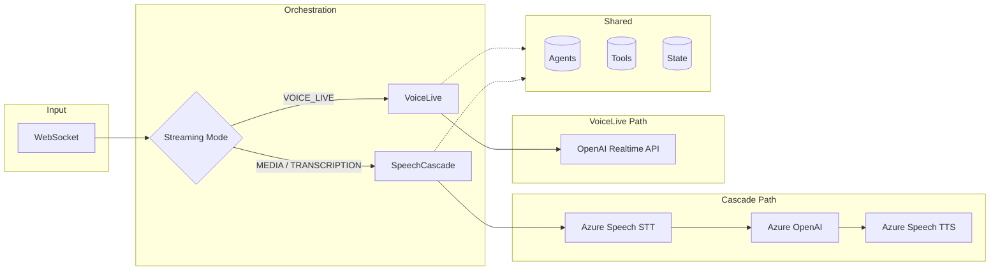

# Orchestration Architecture

This section describes the **dual orchestration architecture** that powers the ART Voice Agent Accelerator. The system supports two distinct orchestration modes, each optimized for different use cases and performance characteristics.

---

## Overview

The accelerator provides two orchestrator implementations that share the same [Unified Agent Framework](../agents/README.md) but differ in how they process audio, execute tools, and manage agent handoffs:

| Mode | Orchestrator | Audio Processing | Best For |
|------|--------------|------------------|----------|
| **SpeechCascade** | `CascadeOrchestratorAdapter` | Azure Speech SDK (STT/TTS) | Fine-grained control, custom VAD |
| **VoiceLive** | `LiveOrchestrator` | OpenAI Realtime API | Lowest latency, managed audio |

Both orchestrators:

- Use the same `UnifiedAgent` configurations from `apps/artagent/backend/agents/`
- Share the centralized tool registry
- Support multi-agent handoffs
- Integrate with `MemoManager` for session state
- Emit OpenTelemetry spans for observability

---

## Architecture Diagram



Both orchestrators share:
- **Agents** — Unified agent registry from `apps/artagent/backend/agents/`
- **Tools** — Centralized tool registry with handoff support
- **State** — `MemoManager` for session persistence

---

## Mode Selection

The orchestration mode is selected via the `ACS_STREAMING_MODE` environment variable:

```bash
# SpeechCascade modes (Azure Speech SDK)
export ACS_STREAMING_MODE=MEDIA          # Raw audio with local VAD
export ACS_STREAMING_MODE=TRANSCRIPTION  # ACS-provided transcriptions

# VoiceLive mode (OpenAI Realtime API)
export ACS_STREAMING_MODE=VOICE_LIVE
```

### Decision Matrix

| Requirement | SpeechCascade | VoiceLive |
|-------------|---------------|-----------|
| Lowest possible latency | ⭐⭐⭐ | ⭐⭐⭐⭐⭐ |
| Custom VAD/segmentation | ⭐⭐⭐⭐⭐ | ⭐⭐ |
| Sentence-level TTS control | ⭐⭐⭐⭐⭐ | ⭐⭐ |
| Azure Speech voices | ⭐⭐⭐⭐⭐ | ⭐⭐ |
| Phrase list customization | ⭐⭐⭐⭐⭐ | ❌ |
| Simplicity of setup | ⭐⭐ | ⭐⭐⭐⭐ |
| Audio quality control | ⭐⭐⭐⭐ | ⭐⭐⭐ |

---

## Shared Abstractions

Both orchestrators use common data structures defined in `apps/artagent/backend/voice/shared/base.py`:

### OrchestratorContext

Input context for turn processing:

```python
@dataclass
class OrchestratorContext:
    """Context for orchestrator turn processing."""
    user_text: str                    # Transcribed user input
    conversation_history: List[Dict]  # Prior messages
    metadata: Dict[str, Any]          # Session metadata
    memo_manager: Optional[MemoManager] = None
```

### OrchestratorResult

Output from turn processing:

```python
@dataclass
class OrchestratorResult:
    """Result from orchestrator turn processing."""
    response_text: str               # Agent response
    tool_calls: List[Dict]           # Tools executed
    handoff_occurred: bool           # Whether agent switched
    new_agent: Optional[str]         # Target agent if handoff
    metadata: Dict[str, Any]         # Telemetry data
```

---

## Turn Processing Patterns

### SpeechCascade: Synchronous Turns

SpeechCascade processes turns synchronously — one complete user utterance triggers one agent response:

```
User Speech → STT → Transcript → LLM (streaming) → Sentences → TTS → Audio
                                      ↓
                              Tool Execution
                                      ↓
                              Handoff Check
```

The `CascadeOrchestratorAdapter.process_turn()` method:

1. Receives complete transcript
2. Renders agent prompt with context
3. Calls Azure OpenAI with tools
4. Streams response sentence-by-sentence to TTS
5. Executes any tool calls
6. Handles handoffs via state update

### VoiceLive: Event-Driven

VoiceLive is event-driven — the orchestrator reacts to events from the OpenAI Realtime API:

```
Audio Stream ←→ OpenAI Realtime API ←→ LiveOrchestrator
                      ↓                       ↓
              Events (transcription,    Event Handlers
              audio delta, tool call)        ↓
                                      Tool Execution
                                             ↓
                                      Handoff + Session Update
```

The `LiveOrchestrator.handle_event()` method routes events:

- `SESSION_UPDATED` → Apply agent configuration
- `INPUT_AUDIO_BUFFER_SPEECH_STARTED` → Barge-in handling
- `RESPONSE_AUDIO_DELTA` → Queue audio for playback
- `RESPONSE_FUNCTION_CALL_ARGUMENTS_DONE` → Execute tool
- `RESPONSE_DONE` → Finalize turn

---

## Handoff Strategies

Both orchestrators support multi-agent handoffs but use different mechanisms:

### State-Based (SpeechCascade)

Handoffs are executed by updating `MemoManager` state:

```python
# In tool execution
if is_handoff_tool(tool_name):
    result = await execute_tool(tool_name, args)
    if result.get("handoff"):
        self._pending_handoff = result["target_agent"]
        memo_manager.set_corememory("pending_handoff", result)

# End of turn
if self._pending_handoff:
    await self._execute_handoff()
```

### Tool-Based (VoiceLive)

Handoffs are immediate upon tool call completion:

```python
async def _execute_tool_call(self, call_id, name, args_json):
    result = await execute_tool(name, json.loads(args_json))
    
    if result.get("handoff"):
        target = result["target_agent"]
        await self._switch_to(target, self._system_vars)
        # Agent switch triggers new session config
    
    # Return result to model
    await self.conn.conversation.item.create(
        FunctionCallOutputItem(call_id=call_id, output=json.dumps(result))
    )
```

---

## MemoManager Integration

Both orchestrators sync state with `MemoManager` for session continuity:

### State Keys

```python
class StateKeys:
    ACTIVE_AGENT = "active_agent"
    PENDING_HANDOFF = "pending_handoff"
    HANDOFF_CONTEXT = "handoff_context"
    PREVIOUS_AGENT = "previous_agent"
    VISITED_AGENTS = "visited_agents"
```

### Sync Patterns

```python
# Restore state at turn start
def _sync_from_memo_manager(self):
    self.active = memo.get_corememory("active_agent")
    self.visited_agents = set(memo.get_corememory("visited_agents"))
    self._system_vars["session_profile"] = memo.get_corememory("session_profile")

# Persist state at turn end
def _sync_to_memo_manager(self):
    memo.set_corememory("active_agent", self.active)
    memo.set_corememory("visited_agents", list(self.visited_agents))
```

---

## Telemetry

Both orchestrators emit OpenTelemetry spans following GenAI semantic conventions:

### Span Hierarchy

```
invoke_agent (per agent session)
├── llm_request (LLM call)
│   ├── tool_execution (each tool)
│   └── tool_execution
└── agent_switch (if handoff)
```

### Key Attributes

| Attribute | Description |
|-----------|-------------|
| `gen_ai.operation.name` | `invoke_agent` |
| `gen_ai.agent.name` | Current agent name |
| `gen_ai.usage.input_tokens` | Tokens consumed |
| `gen_ai.usage.output_tokens` | Tokens generated |
| `voicelive.llm_ttft_ms` | Time to first token |

---

## Deep Dive Documentation

- **[Cascade Orchestrator](cascade.md)** — Detailed guide to `CascadeOrchestratorAdapter`
- **[VoiceLive Orchestrator](voicelive.md)** — Detailed guide to `LiveOrchestrator`

---

## Related Documentation

- [Agent Framework](../agents/README.md) — Unified agent configuration
- [Streaming Modes](../speech/README.md) — Audio processing comparison
- [Handoff Strategies](../agents/handoffs.md) — Multi-agent routing patterns
- [Session Management](../data/README.md) — State persistence
