<!-- markdownlint-disable MD046 MD032 -->
# :material-play-circle: Demo Guide

!!! success "Your Complete Guide to Running the Voice Agent Demo"
    This guide walks you through setting up and using the ART Voice Agent Accelerator demo—from creating your first demo profile to testing advanced multi-agent conversations.

---

## :material-account-school: Choose Your Path

=== "🟢 Basic (Start Here)"
    **Time:** 10-15 minutes | **Goal:** Get talking to an AI agent
    
    1. Create a demo profile
    2. Start a voice conversation
    3. Explore basic agent interactions
    
    **Best for:** First-time users, quick demos, stakeholder presentations

=== "🟡 Intermediate"
    **Time:** 30-45 minutes | **Goal:** Customize and understand the system
    
    Everything in Basic, plus:
    
    1. Create custom agents with the Agent Builder
    2. Configure tools and handoffs
    3. Test both orchestration modes
    
    **Best for:** Developers evaluating the platform, solution architects

=== "🔴 Advanced"
    **Time:** 1-2 hours | **Goal:** Deep platform mastery
    
    Everything in Intermediate, plus:
    
    1. VAD tuning and latency optimization
    2. Custom tool development
    3. Multi-agent orchestration patterns
    4. Performance monitoring and telemetry
    
    **Best for:** Technical leads, platform engineers, production planning

---

## :material-account-plus: Step 1: Create a Demo Profile

Before you can have a personalized conversation with the AI agents, you need to create a demo profile. This generates synthetic customer data that agents use for context-aware interactions.

### Create Your Profile

1. **Open the frontend application** at `http://localhost:5173` (or your deployed URL)

2. **Click the profile icon** (👤) in the bottom navigation bar

3. **Click "Create Demo Profile"** to open the profile creation form

4. **Fill in the required fields:**

    | Field | Description | Example |
    |-------|-------------|---------|
    | **Full Name** | Your display name for the demo | `John Smith` |
    | **Email** | **Use your real work email** if testing MFA features | `john.smith@yourcompany.com` |
    | **Phone Number** (optional) | E.164 format for SMS demos | `+14155551234` |
    | **Preferred Channel** | MFA delivery preference | `email` or `sms` |

!!! warning "Important: Use Your Real Email for MFA Testing"
    If you want to test tools that involve multi-factor authentication (like transaction verification), you **must provide your actual email address**. The system will send real 6-digit verification codes to this email that you'll need to read back to the agent during the conversation. This is enabled through Email Communication Services integrated through Azure Communication Services.

5. **Click "Create Profile"** — The system generates:
    - A unique `client_id` for your session
    - Synthetic financial data (account balances, transaction history)
    - Customer intelligence data (communication preferences, relationship history)
    - Demo-safe verification codes

!!! info "Profile Expiration"
    Demo profiles automatically expire after **24 hours** and are purged from the system. All data is synthetic and safe for demos.

### What Gets Generated

Your demo profile includes rich context that agents use for personalized interactions:

!!! example "Sample Demo Profile: john_smith_cfs"
    
    **Institution:** Contoso Financial Services  
    **Relationship Tier:** Platinum  
    **Client Since:** 2019
    
    | Category | Data |
    |----------|------|
    | **Current Balance** | $542,000 |
    | **YTD Transaction Volume** | $8.2M |
    | **Risk Tolerance** | Moderate |
    | **Account Health Score** | 94 |
    
    **Customer Intelligence:**
    
    - Communication Style: Direct/Business-focused
    - Preferred Resolution: Fast, efficient solutions
    - Known Preferences: Quick summaries over detail
    
    **Verification Codes (for demo MFA):**
    
    - SSN Last 4: `7823`
    - Phone Last 4: `1234`  
    - Employee ID: `4521`

---

## :material-robot: Step 2: Create and Configure Agents (Intermediate)

The Agent Builder lets you create custom AI agents directly from the frontend without editing YAML files.

### Open the Agent Builder

1. **Click the robot icon** (🤖) in the bottom navigation bar
2. **The Agent Builder panel** opens on the left side

### Understanding Agent Configuration

| Configuration | Description | Example Values |
|---------------|-------------|----------------|
| **Name** | Unique identifier for the agent | `CustomerSupportAgent` |
| **Description** | What this agent specializes in | `Handles billing inquiries` |
| **System Prompt** | Instructions that define agent behavior | `You are a helpful billing specialist...` |
| **Greeting** | First message when agent activates | `Hello! I'm here to help with billing.` |
| **Return Greeting** | Message when returning to this agent | `Welcome back! Where were we?` |
| **Voice** | Neural voice for TTS | `en-US-JennyNeural` |
| **Temperature** | Response creativity (0.0-1.0) | `0.7` |

### Configure Tools

Tools give agents capabilities to take actions. Select from available tools:

| Tool Category | Examples | Use Case |
|---------------|----------|----------|
| **Account Tools** | `get_account_summary`, `get_balance` | Financial inquiries |
| **Transaction Tools** | `get_transactions`, `verify_transaction` | Transaction lookups |
| **MFA Tools** | `send_verification_code`, `verify_code` | Security verification |
| **Transfer Tools** | `transfer_call_to_call_center` | Live agent escalation |
| **Handoff Tools** | `handoff_fraud_agent`, `handoff_concierge` | Agent-to-agent routing |

### Configure Handoffs

Handoffs enable multi-agent conversations. When you add a handoff tool:

1. **Add the handoff tool** to the agent's tool list (e.g., `handoff_fraud_agent`)
2. **The handoff map** automatically routes calls to the target agent
3. **Context is preserved** — the new agent knows why the customer was transferred

Example handoff configuration:

```mermaid
flowchart LR
    subgraph CustomerConcierge["🎧 CustomerConcierge"]
        direction TB
        T1["handoff_fraud_agent"]
        T2["handoff_trading_desk"]
        T3["get_account_summary"]
    end
    
    CustomerConcierge -->|"Card stolen?"| FA["🔒 FraudAgent"]
    CustomerConcierge -->|"Trade stocks?"| TA["📈 TradingAgent"]
```



### Configure VAD (Voice Activity Detection)

VAD settings control how the system detects when you're speaking:

| Setting | Description | Recommended |
|---------|-------------|-------------|
| **Threshold** | Sensitivity to speech (0.0-1.0) | `0.5` (balanced) |
| **Prefix Padding (ms)** | Audio to keep before speech | `300` |
| **Silence Duration (ms)** | Silence before turn ends | `500` |

!!! tip "VAD Tuning Tips"
    - **Noisy environment?** Increase threshold to `0.6-0.7`
    - **Quick responses needed?** Reduce silence duration to `300-400ms`
    - **Agent cutting you off?** Increase silence duration to `600-800ms`

### Voice Configuration

!!! warning "Region-Dependent Voices"
    Available neural voices **depend on your Azure Speech Services region**. Not all voices are available in all regions. An API-based retrieval of available voices will be added in a future release.

Popular voice options:

| Voice | Style | Best For |
|-------|-------|----------|
| `en-US-JennyNeural` | Conversational | General customer service |
| `en-US-SaraNeural` | Friendly | Casual interactions |
| `en-US-GuyNeural` | Professional | Business contexts |
| `en-US-AriaNeural` | Expressive | Dynamic conversations |

---

## :material-microphone: Step 3: Start a Voice Conversation

### Launch the Voice Interface

1. **Click the person icon** (👤) in the bottom navigation to access conversation mode
2. **You'll see two orchestration options:**

### Choose Your Orchestration Mode

#### "Voice Live (Recommended for Low Latency)"
    
    **How it works:** Audio streams directly to OpenAI's Realtime API
    
    ```mermaid
    flowchart LR
        A["🎤 Your Voice"] --> B["OpenAI Realtime API"]
        B --> C["🔊 Audio Response"]
    ```
    
    **Characteristics:**
    
    | Metric | Typical Value |
    |--------|---------------|
    | End-to-end latency | ~200-400ms |
    | Barge-in handling | Automatic |
    | Audio processing | Server-managed VAD |
    | Voice options | OpenAI voices |
    
    **Best for:**
    
    - Lowest possible latency requirements
    - Simple, fast demos
    - When Azure Speech customization isn't needed

#### "Cascade (Recommended for Control)"
    
    **How it works:** Audio flows through Azure Speech services with separate STT and TTS
    
    ```mermaid
    flowchart LR
        A["🎤 Your Voice"] --> B["Azure STT"]
        B --> C["LLM"]
        C --> D["Azure TTS"]
        D --> E["🔊 Audio"]
    ```
    
    **Characteristics:**
    
    | Metric | Typical Value |
    |--------|---------------|
    | End-to-end latency | ~400-800ms |
    | Barge-in handling | Custom VAD |
    | Audio processing | Azure Speech SDK |
    | Voice options | Azure Neural Voices |
    
    **Best for:**
    
    - Custom VAD/segmentation control
    - Azure Neural Voice selection
    - Phrase list customization for domain terms
    - Fine-grained audio control

### Start Speaking

1. **Allow microphone access** when prompted
2. **Wait for the greeting** — the active agent introduces itself
3. **Start your conversation!**

---

## :material-chat-processing: Step 4: Understanding the Conversation Flow

### What to Observe During Conversations

```mermaid
flowchart LR
    subgraph Input["🎤 You Speak"]
        MIC["Microphone"]
    end
    
    subgraph Processing["⚙️ System Processing"]
        VAD["VAD\nDetection"]
        STT["Speech-to-Text\n(Transcription)"]
        LLM["LLM\nInference"]
        TTS["Text-to-Speech"]
    end
    
    subgraph Output["🔊 Agent Responds"]
        AUDIO["Audio Output"]
    end
    
    MIC --> VAD
    VAD --> STT
    STT --> LLM
    LLM --> TTS
    TTS --> AUDIO
    
    VAD -.->|"Barge-in\nDetection"| TTS
```



### Key Metrics to Watch

| Metric | What It Means | Healthy Range |
|--------|---------------|---------------|
| **VAD Latency** | Time to detect speech start/stop | < 100ms |
| **STT Latency** | Time to transcribe your speech | < 500ms |
| **LLM TTFT** | Time to first token from LLM | < 300ms |
| **TTS Latency TTFB** | Time to start audio playback | < 200ms |
| **Total Turn Time** | End-to-end response time | < 1.5s |

### Handoff Behavior

When an agent hands off to another agent:

1. **Context Transfer** — The new agent receives conversation context
2. **Greeting** — New agent introduces itself with context
3. **Seamless Continuation** — Conversation continues without repeating information

**Example handoff flow:**

```mermaid
sequenceDiagram
    participant U as 👤 You
    participant C as 🎧 Concierge
    participant F as 🔒 FraudAgent
    
    U->>C: "I think someone stole my credit card"
    C->>C: Detects fraud concern
    C->>U: "I'm connecting you with our fraud specialist right away."
    C-->>F: Handoff with context
    F->>U: "I'm the fraud specialist. I understand you're concerned about potential unauthorized activity. Let me help you secure your account immediately."
```



### Watch for Anomalies

| Anomaly | Possible Cause | Solution |
|---------|----------------|----------|
| **Agent cuts off mid-sentence** | VAD silence too short | Increase `silence_duration_ms` |
| **Long pauses before response** | High LLM latency | Check Azure OpenAI quotas |
| **Echo or feedback** | Microphone picking up speaker | Use headphones |
| **Transcription errors** | Background noise | Adjust VAD threshold |
| **Handoff not triggering** | Missing handoff tool | Check agent tool configuration |

---

## :material-test-tube: Demo Scenarios to Try

### Basic Scenarios

| Scenario | What to Say | Expected Behavior |
|----------|-------------|-------------------|
| **Account Inquiry** | "What's my account balance?" | Agent retrieves synthetic balance |
| **Transaction History** | "Show me my recent transactions" | Agent lists demo transactions |
| **Profile Info** | "What's my relationship tier?" | Agent confirms Platinum/Gold tier |

### MFA Scenarios (Requires Real Email)

| Scenario | What to Say | Expected Behavior |
|----------|-------------|-------------------|
| **Verification Request** | "I need to verify a large transaction" | Agent sends code to your email |
| **Code Verification** | Read the 6-digit code aloud | Agent verifies and proceeds |

### Handoff Scenarios

| Scenario | What to Say | Expected Behavior |
|----------|-------------|-------------------|
| **Fraud Concern** | "I think my card was stolen" | Handoff to FraudAgent |
| **Investment Question** | "I want to discuss my portfolio" | Handoff to InvestmentAdvisor |
| **Return to Concierge** | "Take me back to the main menu" | Handoff to Concierge |

### Barge-in Testing

| Scenario | What to Do | Expected Behavior |
|----------|------------|-------------------|
| **Interrupt Agent** | Start speaking while agent talks | Agent stops, processes your input |
| **Quick Follow-up** | Speak immediately after agent | Barge-in triggers if within window |

---

## :material-bug: Troubleshooting

### Quick Diagnostics

```bash
# Check backend health
curl http://localhost:8010/health

# Check readiness (all dependencies)
curl http://localhost:8010/readiness

# View available agents
curl http://localhost:8010/api/v1/agents
```

### Environment Variables Checklist

Ensure your root `.env` file contains:

```bash
# ===== Required for Voice =====
AZURE_SPEECH_REGION=eastus          # Your Speech Services region
AZURE_SPEECH_KEY=<your-key>         # Or use managed identity

# ===== Required for AI =====
AZURE_OPENAI_ENDPOINT=https://<your-aoai>.openai.azure.com
AZURE_OPENAI_KEY=<your-key>
AZURE_OPENAI_DEPLOYMENT=gpt-4o      # Your deployment name

# ===== For Demo Profiles =====
AZURE_COSMOS_CONNECTION_STRING=<cosmos-conn-string>
AZURE_COSMOS_DATABASE_NAME=financial_services_db

# ===== For Session State =====
REDIS_HOST=<redis-host>
REDIS_PORT=6380
REDIS_PASSWORD=<redis-password>

# ===== Orchestration Mode =====
ACS_STREAMING_MODE=VOICE_LIVE       # or MEDIA for Cascade

# ===== Dev Tunnel (local dev) =====
BASE_URL=https://<tunnel-url>       # From devtunnel host
```

### Common Issues

!!! question "No audio response from agent"
    **Check:**
    
    1. Microphone permissions granted in browser
    2. `AZURE_SPEECH_KEY` and `AZURE_SPEECH_REGION` are set
        1. if using RBAC, `AZURE_SPEECH_REGION` and `AZURE_SPEECH_RESOURCE_ID` are required
    3. Backend is running and healthy (`curl http://localhost:8010/health`)
    4. WebSocket connection is established (check browser console)

!!! question "Profile not loading in conversation"
    **Check:**
    
    1. Redis & CosmosDB are running and accessible
    2. Demo profile was created successfully (check for success message)
    3. Session ID matches between frontend and backend
    4. Try creating a new profile
    

!!! question "Handoffs not working"
    **Check:**
    
    1. Handoff tool is in the source agent's tool list
    2. Target agent exists and is loaded
    3. Check backend logs for handoff events
    4. Verify handoff map includes the tool

!!! question "High latency responses"
    **Check:**
    
    1. Azure OpenAI quota not exceeded
    2. Network connectivity to Azure services
    3. Try Voice Live mode for lower latency
    4. Check for cold start (first request is slower)

!!! question "Transcription errors"
    **Check:**
    
    1. Microphone quality and positioning
    2. Background noise levels
    3. Add domain terms to phrase lists (Cascade mode)
    4. Adjust VAD threshold settings

### Log Locations

| Component | Location | What to Look For |
|-----------|----------|------------------|
| **Backend** | Terminal running uvicorn | WebSocket events, tool calls, handoffs |
| **Frontend** | Browser DevTools Console | Connection status, errors |
| **Azure** | Application Insights | Distributed traces, latency |

### Getting Help

- **[GitHub Issues](https://github.com/Azure-Samples/art-voice-agent-accelerator/issues)** — Report bugs
- **[Troubleshooting Guide](../operations/troubleshooting.md)** — Detailed solutions
- **[API Reference](../api/README.md)** — Endpoint documentation

---

## :material-arrow-right: Next Steps

=== "After Basic"
    - Try the [Agent Builder](#open-the-agent-builder) to create custom agents
    - Explore different [orchestration modes](#choose-your-orchestration-mode)
    - Review the [Architecture Overview](../architecture/README.md)

=== "After Intermediate"
    - Deep dive into [Handoff Strategies](../architecture/agents/handoffs.md)
    - Learn about [Telemetry](../architecture/telemetry.md) and monitoring
    - Try [Load Testing](../operations/load-testing.md)

=== "After Advanced"
    - Set up [Production Deployment](../deployment/production.md)
    - Configure [CI/CD Pipelines](../deployment/cicd.md)
    - Implement custom tools and integrations

<!-- markdownlint-enable MD046 MD032 -->
