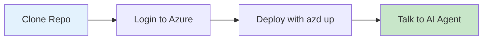

## Step-by-Step: Build Your First Agent

Use this guided flow with screenshots to create and run your first agent.

1) Open the Agent Builder
    - Navigate to the Agent Builder home screen.
    - You should see the initial landing page like below.

    

2) Choose a Template
    - Pick a starter template to accelerate setup (recommended for first-time use).
    - Confirm the template details and proceed.

    

3) Configure Basics
    - Enter a name and short description for your agent.
    - Keep defaults for optional fields on your first run; you can refine later.

4) Create the Agent
    - Click Create (or equivalent action) to scaffold your agent from the template.
    - Wait for confirmation that resources and defaults are ready.

5) Verify the Entry Screen
    - After creation, you’ll land on the agent’s entry or overview page.
    - Use this page to review configuration, flows, and next steps.

6) Run a Simple Test
    - Follow the prompts in the UI (or the Local Development guide) to start your agent.
    - Validate you can reach the agent’s health/status endpoints before moving on.

7) Iterate
    - Tweak prompts/parameters, then re-run and observe results.
    - Commit changes as you validate behavior.

Tip: If images don’t render in your local doc viewer, verify relative paths from the `docs/getting-started` folder or open the repository in VS Code’s Markdown preview.

# :material-rocket-launch: Quickstart

!!! success "From Zero to Running Voice Agent in 15 Minutes"
    This guide gets you from clone to a working voice agent as fast as possible.

---

## :material-timer: What You'll Accomplish



| Step | Time | What Happens |
|------|------|--------------|
| Clone & Login | 2 min | Get the code, authenticate |
| Deploy | 12 min | Azure resources + app deployment |
| Test | 1 min | Open browser, start talking |

---

## :material-clipboard-check: Before You Start

!!! warning "Prerequisites Required"
    Make sure you've completed the [Prerequisites](prerequisites.md) first:
    
    - [x] Azure CLI installed and logged in
    - [x] Azure Developer CLI installed
    - [x] Docker running
    - [x] Azure subscription with Contributor access

---

## :material-numeric-1-circle: Clone the Repository

```bash
git clone https://github.com/Azure-Samples/art-voice-agent-accelerator.git
cd art-voice-agent-accelerator
```

---

## :material-numeric-2-circle: Login to Azure

```bash
# Login to Azure CLI (opens browser)
az login

# Login to Azure Developer CLI
azd auth login
```

---

## :material-numeric-3-circle: Deploy Everything

```bash
azd up
```

!!! info "What `azd up` Does"
    This single command handles everything:
    
    1. **Creates Azure resources** (~12 min)
        - Azure OpenAI (GPT-4o)
        - Azure Speech Services
        - Azure Communication Services
        - Cosmos DB, Redis, Storage
        - Container Apps (frontend + backend)
    
    2. **Builds and deploys** your application
    
    3. **Generates `.env.local`** for local development

### During Deployment

You'll be prompted for:

| Prompt | What to Enter |
|--------|---------------|
| Environment name | A short name (e.g., `dev`, `myname-dev`) |
| Azure subscription | Select from list |
| Azure location | Choose a region (e.g., `eastus`, `westus2`) |
| Remote state storage | Press `Y` (recommended) |

### Deployment Hooks

The deployment runs automated pre-provisioning and post-provisioning scripts:

**Pre-Provisioning (`preprovision.sh`):**

- ✅ Validates required CLI tools (az, azd, jq, docker)
- ✅ Installs Azure CLI extensions (quota, redisenterprise, cosmosdb-preview)
- ✅ Checks Azure authentication
- ✅ Configures ARM_SUBSCRIPTION_ID
- ✅ Registers required Azure resource providers
- ✅ Checks regional service availability
- ✅ Sets up Terraform remote state storage

**Post-Provisioning (`postprovision.sh`):**

- ✅ Initializes Cosmos DB database
- ✅ Configures phone number (interactive prompt)
- ✅ Updates App Configuration URLs
- ✅ Syncs app settings
- ✅ Generates `.env.local` for local development

### Deployment Output

When complete, you'll see:

```
Deploying services (azd deploy)

  (✓) Done: Deploying service rtaudio-client
  (✓) Done: Deploying service rtaudio-server

SUCCESS: Your application was deployed to Azure!

  Frontend: https://ca-frontend-xxxxx.azurecontainerapps.io
  Backend:  https://ca-backend-xxxxx.azurecontainerapps.io
```

---

## :material-numeric-4-circle: Open Your Voice Agent

1. **Copy the Frontend URL** from the deployment output
2. **Open it in your browser**
3. **Allow microphone access** when prompted
4. **Start talking!** 🎤

!!! success "You're Done!"
    Your AI voice agent is now running. Try asking it questions about insurance, account balances, or just have a conversation.

---

## :material-help-circle: Quick Troubleshooting

??? failure "Deployment failed with permission error"
    You need **Contributor** access on your Azure subscription.
    
    ```bash
    # Check your current permissions
    az role assignment list --assignee $(az account show --query user.name -o tsv)
    ```
    
    Contact your Azure admin if you don't have sufficient permissions.

??? failure "Docker is not running"
    Start Docker Desktop before running `azd up`.
    
    ```bash
    # Verify Docker is running
    docker info
    ```

??? failure "azd up hangs or times out"
    Some Azure resources take time to provision. If it times out:
    
    ```bash
    # Resume deployment
    azd provision
    azd deploy
    ```

??? question "How do I see what was created?"
    ```bash
    # List all resources
    azd env get-values
    
    # Or check in Azure Portal
    # Search for your environment name
    ```

---

## :material-scenario: Configure Your First Scenario

Once your agent is deployed, create a scenario to define what conversations your agent can handle. Follow these steps:

1) **Access the Scenario Builder**
   - From the agent home, navigate to the "Scenarios" or "Flows" section.
   - Click "Create New Scenario" or "Add Scenario".

   

2) **Open the Scenario Builder**
   - The scenario builder interface appears, showing available tools and configuration options.
   - Start with a blank scenario or use a pre-built template.

   

3) **Define the Knowledge Base (KB)**
   - Set up a general knowledge base or attach specific documents/instructions.
   - This KB acts as context for the agent's responses during conversations.
   - You can upload FAQs, product docs, or policy documents.

   

4) **Configure Conversation Flow**
   - Define how the agent should greet users (e.g., "Hello, how can I help?").
   - Set up handoff rules (e.g., "Transfer to human agent if request is unresolved").
   - Add any business logic or decision trees specific to your use case.

5) **Add Connected Authentication (Optional)**
   - Integrate backend systems for identity verification and account lookups.
   - The agent can now authenticate users and securely access customer data.

   

6) **Configure Parallel Processing & Fraud Detection (Optional)**
   - Set up parallel workflows to handle multiple tasks simultaneously.
   - Add fraud detection rules or business validation logic that runs alongside conversations.

   

7) **Test the Scenario**
    - In the main UI, click the person icon to start a conversation (Speech Cascade or Voice Live).
    - Expect the start agent to greet you; continue the dialog to verify KB responses and routing.
    - Refine the KB, prompts, or routing rules as needed.

8) **Publish the Scenario**
   - Once satisfied, publish the scenario to make it live.
   - Your agent will now use this scenario for incoming calls or messages.

Tip: Start simple. A basic greeting + KB + handoff rule covers most first-time scenarios. Add connected auth and fraud detection as you scale and iterate.

---

## :material-arrow-right: Next Steps

| What You Want | Guide |
|---------------|-------|
| **Run locally** for development | [Local Development](local-development.md) |
| **Try the full demo** with agents | [Demo Guide](demo-guide.md) |
| **Understand the architecture** | [Architecture Overview](../architecture/README.md) |
| **Add a phone number** for PSTN calls | [Phone Number Setup](../deployment/phone-number-setup.md) |
| **Customize agents** | [Agent Framework](../architecture/agents/README.md) |

---

## :material-delete: Cleanup

When you're done, remove all Azure resources:

```bash
azd down --force --purge
```

!!! warning "This deletes everything"
    This command removes all Azure resources created by `azd up`. Your code remains intact.
