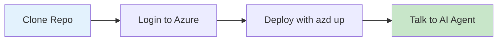

# :material-rocket-launch: Quickstart

!!! success "From Zero to Running Voice Agent in 15 Minutes"
    This guide gets you from clone to a working voice agent as fast as possible.

---

## :material-timer: What You'll Accomplish



| Step | Time | What Happens |
|------|------|--------------|
| Clone & Login | 2 min | Get the code, authenticate |
| Deploy | 12 min | Azure resources + app deployment |
| Test | 1 min | Open browser, start talking |

---

## :material-clipboard-check: Before You Start

!!! warning "Prerequisites Required"
    Make sure you've completed the [Prerequisites](prerequisites.md) first:
    
    - [x] Azure CLI installed and logged in
    - [x] Azure Developer CLI installed
    - [x] Docker running
    - [x] Azure subscription with Contributor access

---

## :material-numeric-1-circle: Clone the Repository

```bash
git clone https://github.com/Azure-Samples/art-voice-agent-accelerator.git
cd art-voice-agent-accelerator
```

---

## :material-numeric-2-circle: Login to Azure

```bash
# Login to Azure CLI (opens browser)
az login

# Login to Azure Developer CLI
azd auth login
```

---

## :material-numeric-3-circle: Deploy Everything

```bash
azd up
```

!!! info "What `azd up` Does"
    This single command handles everything:
    
    1. **Creates Azure resources** (~12 min)
        - Azure OpenAI (GPT-4o)
        - Azure Speech Services
        - Azure Communication Services
        - Cosmos DB, Redis, Storage
        - Container Apps (frontend + backend)
    
    2. **Builds and deploys** your application
    
    3. **Generates `.env.local`** for local development

### During Deployment

You'll be prompted for:

| Prompt | What to Enter |
|--------|---------------|
| Environment name | A short name (e.g., `dev`, `myname-dev`) |
| Azure subscription | Select from list |
| Azure location | Choose a region (e.g., `eastus`, `westus2`) |
| Remote state storage | Press `Y` (recommended) |

### Deployment Output

When complete, you'll see:

```
Deploying services (azd deploy)

  (✓) Done: Deploying service rtaudio-client
  (✓) Done: Deploying service rtaudio-server

SUCCESS: Your application was deployed to Azure!

  Frontend: https://ca-frontend-xxxxx.azurecontainerapps.io
  Backend:  https://ca-backend-xxxxx.azurecontainerapps.io
```

---

## :material-numeric-4-circle: Open Your Voice Agent

1. **Copy the Frontend URL** from the deployment output
2. **Open it in your browser**
3. **Allow microphone access** when prompted
4. **Start talking!** 🎤

!!! success "You're Done!"
    Your AI voice agent is now running. Try asking it questions about insurance, account balances, or just have a conversation.

---

## :material-help-circle: Quick Troubleshooting

??? failure "Deployment failed with permission error"
    You need **Contributor** access on your Azure subscription.
    
    ```bash
    # Check your current permissions
    az role assignment list --assignee $(az account show --query user.name -o tsv)
    ```
    
    Contact your Azure admin if you don't have sufficient permissions.

??? failure "Docker is not running"
    Start Docker Desktop before running `azd up`.
    
    ```bash
    # Verify Docker is running
    docker info
    ```

??? failure "azd up hangs or times out"
    Some Azure resources take time to provision. If it times out:
    
    ```bash
    # Resume deployment
    azd provision
    azd deploy
    ```

??? question "How do I see what was created?"
    ```bash
    # List all resources
    azd env get-values
    
    # Or check in Azure Portal
    # Search for your environment name
    ```

---

## :material-arrow-right: Next Steps

| What You Want | Guide |
|---------------|-------|
| **Run locally** for development | [Local Development](local-development.md) |
| **Try the full demo** with agents | [Demo Guide](demo-guide.md) |
| **Understand the architecture** | [Architecture Overview](../architecture/README.md) |
| **Add a phone number** for PSTN calls | [Phone Number Setup](../deployment/phone-number-setup.md) |
| **Customize agents** | [Agent Framework](../architecture/agents/README.md) |

---

## :material-delete: Cleanup

When you're done, remove all Azure resources:

```bash
azd down --force --purge
```

!!! warning "This deletes everything"
    This command removes all Azure resources created by `azd up`. Your code remains intact.
