# Industry Solutions

Learn how to configure voice agent scenarios for your specific industry. Each guide explains the scenario architecture, agent orchestration patterns, and handoff strategies tailored to industry-specific use cases.

---

## What Are Scenarios?

A **scenario** is a configuration that defines:

- **Which agents** participate in a conversation
- **How handoffs** between agents behave
- **Template variables** that customize agent behavior

```mermaid
flowchart LR
    subgraph Scenario["📋 Scenario Configuration"]
        direction TB
        S1["start_agent<br/>Entry point"]
        S2["agents[]<br/>Participants"]
        S3["handoffs[]<br/>Routing rules"]
        S4["agent_defaults<br/>Variables"]
    end
    
    subgraph Agents["🤖 Reusable Agents"]
        A1[Concierge]
        A2[AuthAgent]
        A3[FraudAgent]
        A4[InvestmentAdvisor]
    end
    
    Scenario -->|"configures"| Agents
```



### Why Scenarios?

| Without Scenarios | With Scenarios |
|-------------------|----------------|
| Handoff logic embedded in agents | Handoff logic in one config file |
| Same agent, same behavior everywhere | Same agent, different behavior per industry |
| Changing routes = edit multiple agents | Changing routes = edit one YAML file |
| Tight coupling between agents | Loose coupling, reusable agents |

---

## Available Industry Scenarios

<div class="grid cards" markdown>

-   :material-bank:{ .lg .middle } **Banking**

    ---

    Private banking and wealth management with personalized concierge service.

    [:octicons-arrow-right-24: Banking Guide](banking.md)

-   :material-shield-check:{ .lg .middle } **Insurance**

    ---

    Claims processing and fraud detection with security-first authentication.

    [:octicons-arrow-right-24: Insurance Guide](insurance.md)

-   :material-hospital:{ .lg .middle } **Healthcare**

    ---

    Nurse triage with symptom assessment and clinical knowledge base.

    [:octicons-arrow-right-24: Healthcare Guide](healthcare.md)

</div>

---

## Quick Comparison

| Aspect | Banking | Insurance | Healthcare |
|--------|---------|-----------|------------|
| **Entry Point** | Concierge | AuthAgent | NurseTriage |
| **Model** | Service-first | Security-first | Assessment-first |
| **Key Specialists** | Investment, Cards | Fraud | RN, Emergency |
| **Default Handoff** | Mixed | Announced | Announced |
| **Compliance** | Financial regs | Insurance regs | HIPAA |

### Architecture Patterns

```mermaid
flowchart TB
    subgraph Banking["🏦 Banking: Hub & Spoke"]
        BC[Concierge] --> BA[Auth]
        BC --> BI[Investment]
        BC --> BR[Cards]
        BA --> BC
        BI --> BC
        BR --> BC
    end
    
    subgraph Insurance["🛡️ Insurance: Linear Security"]
        IA[Auth] --> IF[Fraud]
        IF --> IA
    end
    
    subgraph Healthcare["🏥 Healthcare: Triage Escalation"]
        HT[Triage] --> HN[RN]
        HT --> HE[Emergency]
    end
    
    style BC fill:#9b59b6,color:#fff
    style IA fill:#e74c3c,color:#fff
    style HT fill:#2ecc71,color:#fff
```



---

## Choosing Your Pattern

### Hub & Spoke (Banking)

Best for:

- High-touch customer service
- Multiple specialized departments
- Personalization is key

```yaml
start_agent: Concierge
agents: [Concierge, Auth, Investment, Cards, ...]
```

### Linear Security (Insurance)

Best for:

- Regulated industries
- Security/compliance first
- Smaller agent set

```yaml
start_agent: AuthAgent
agents: [AuthAgent, FraudAgent, ClaimsAgent]
```

### Triage Escalation (Healthcare)

Best for:

- Assessment-based routing
- Urgency-driven handoffs
- Human escalation paths

```yaml
start_agent: TriageAgent
agents: [TriageAgent, Nurse, Emergency]
```

---

## Creating Your Own Scenario

### Step 1: Define Your Agent Graph

Draw out which agents you need and how they connect:


### Step 2: Create the Scenario YAML

```yaml title="registries/scenariostore/retail/scenario.yaml"
name: retail
description: Retail customer service with tech support and billing

start_agent: CustomerService

agents:
  - CustomerService
  - TechSupport
  - Billing
  - Returns

handoffs:
  - from: CustomerService
    to: TechSupport
    tool: handoff_tech_support
    type: discrete

  - from: CustomerService
    to: Billing
    tool: handoff_billing
    type: announced    # Billing is sensitive

  # ... return paths
```

### Step 3: Configure Template Variables

```yaml
agent_defaults:
  company_name: "Retail Co"
  industry: "retail"
  return_policy_days: 30
  support_hours: "9am-9pm EST"
```

### Step 4: Test Your Scenario

```python
from registries.scenariostore.loader import load_scenario

scenario = load_scenario("retail")
assert scenario.start_agent == "CustomerService"
```

---

## Understanding Handoff Types

Scenarios define **how** handoffs feel to the customer:

### Announced (Explicit Greeting)

```yaml
type: announced
```

The target agent greets the customer:

> **Source:** "Let me connect you with our billing team."  
> **Target:** "Hi, I'm with billing. How can I help?"

**Use for:** Security operations, department changes, sensitive topics

### Discrete (Seamless Continuation)

```yaml
type: discrete
```

The conversation continues naturally:

> **Source:** "I see you have a billing question about your invoice..."  
> **Target:** *(continues)* "Looking at invoice #1234, I can see the charge in question."

**Use for:** Specialist routing, topic shifts, returning to main agent

---

## Loading Scenarios in Code

```python
from registries.scenariostore.loader import (
    load_scenario,
    get_scenario_agents,
    build_handoff_map_from_scenario,
    get_handoff_config,
)

# Load scenario configuration
scenario = load_scenario("banking")
print(f"Starting with: {scenario.start_agent}")

# Get agents with overrides applied
agents = get_scenario_agents("banking")

# Build handoff routing map
handoff_map = build_handoff_map_from_scenario("banking")
# {"handoff_fraud_agent": "FraudAgent", ...}

# Check specific handoff behavior
cfg = get_handoff_config("banking", "Concierge", "handoff_to_auth")
print(f"Auth handoff is: {cfg.type}")  # "announced"
```

---

## Next Steps

1. **Choose your pattern** — Hub & spoke, linear security, or triage escalation
2. **Review an industry guide** — [Banking](banking.md), [Insurance](insurance.md), or [Healthcare](healthcare.md)
3. **Create your scenario** — Define agents, handoffs, and variables
4. **Test the flow** — Verify handoff behavior matches your design

---

## Related Documentation

- [Agent Framework](../architecture/agents/README.md) — How agents are configured
- [Handoff Strategies](../architecture/agents/handoffs.md) — Deep dive on handoff patterns
- [Quick Start](../getting-started/quickstart.md) — Get up and running
