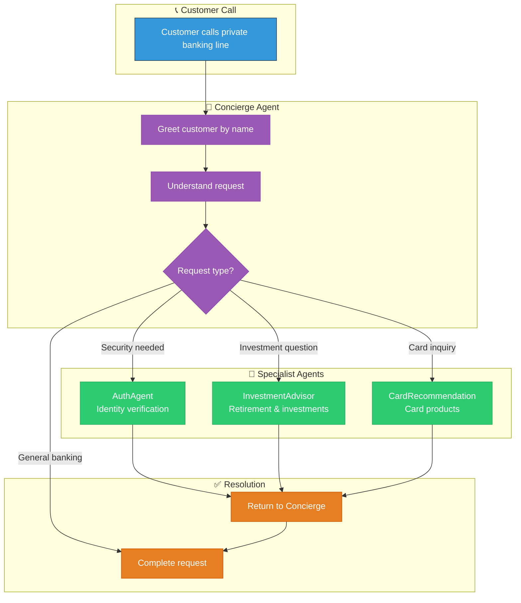
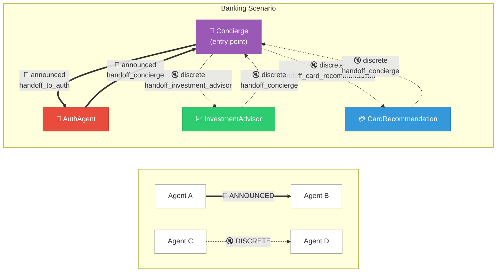
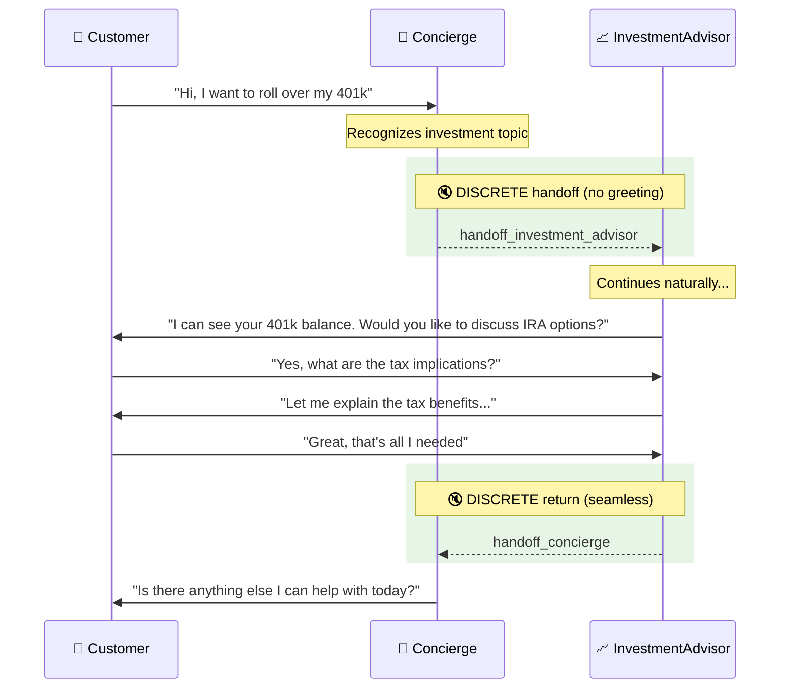
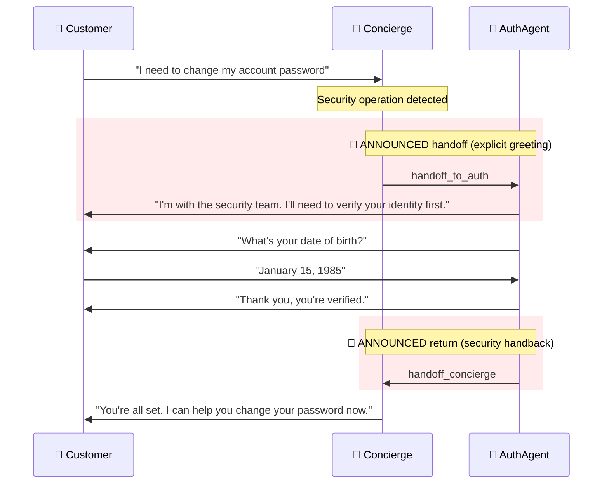

# Banking Voice Agent Scenario

This guide explains the **Private Banking Customer Service Scenario** — a multi-agent voice system designed for wealth management and private banking use cases. You'll learn how the scenario orchestrates agent handoffs to deliver a seamless customer experience.

---

## Business Value

| Capability | Business Impact |
|------------|-----------------|
| **VIP Concierge Service** | Premium experience for high-net-worth clients |
| **Card Recommendation Engine** | Increase card product adoption, match benefits to lifestyle |
| **401(k) Rollover Guidance** | Capture rollover assets, grow AUM |
| **Investment Advisory** | Retirement planning, tax optimization |
| **Real-Time Fee Resolution** | Immediate refunds, improved satisfaction |

---

## Scenario Overview

The banking scenario demonstrates a **concierge-led model** where a primary agent handles most interactions and routes to specialists when needed.



---

## Quick Start

To use the banking scenario, specify it when starting a call session:

```python
from registries.scenariostore.loader import (
    load_scenario,
    get_scenario_agents,
    build_handoff_map_from_scenario,
)

# Load the banking scenario
scenario = load_scenario("banking")

# Get agents configured for banking
agents = get_scenario_agents("banking")

# Build handoff routing
handoff_map = build_handoff_map_from_scenario("banking")
# → {"handoff_to_auth": "AuthAgent", "handoff_investment_advisor": "InvestmentAdvisor", ...}
```

---

## Understanding the Scenario Configuration

The banking scenario is defined in a single YAML file that controls the entire agent orchestration:

```yaml title="registries/scenariostore/banking/orchestration.yaml"
# Banking Customer Service Scenario
# Optimized for private banking and wealth management

name: banking
description: Private banking customer service with personalized greetings and financial tools

# Starting agent - where every call begins
start_agent: Concierge

# Agents participating in this scenario
agents:
  - Concierge
  - AuthAgent
  - InvestmentAdvisor
  - CardRecommendation

# Default handoff behavior
handoff_type: announced

# Handoff routes - the "wiring" between agents
handoffs:
  # Concierge routes to specialists
  - from: Concierge
    to: AuthAgent
    tool: handoff_to_auth
    type: announced           # Auth is sensitive - always greet

  - from: Concierge
    to: InvestmentAdvisor
    tool: handoff_investment_advisor
    type: discrete            # Seamless handoff
    share_context: true

  - from: Concierge
    to: CardRecommendation
    tool: handoff_card_recommendation
    type: discrete            # Seamless handoff
    share_context: true

  # Specialists return to Concierge
  - from: AuthAgent
    to: Concierge
    tool: handoff_concierge
    type: announced

  - from: InvestmentAdvisor
    to: Concierge
    tool: handoff_concierge
    type: discrete            # Returning - seamless

  - from: CardRecommendation
    to: Concierge
    tool: handoff_concierge
    type: discrete            # Returning - seamless

# Template variables for all agents
agent_defaults:
  company_name: "Private Banking"
  industry: "banking"
  compliance_required: true
  region: "US"
```

---

## Scenario Components Explained

### 1. Entry Point: `start_agent`

```yaml
start_agent: Concierge
```

Every customer call begins with the **Concierge** agent. This is the "front door" of the banking experience — a knowledgeable assistant who can handle most requests and knows when to bring in specialists.

!!! tip "Why a Concierge Model?"
    Private banking customers expect personalized service. Starting with a concierge who knows their name and account history creates a premium experience, rather than forcing customers to navigate a menu system.

### 2. Agent Selection: `agents`

```yaml
agents:
  - Concierge
  - AuthAgent
  - InvestmentAdvisor
  - CardRecommendation
```

The scenario explicitly lists which agents participate. This means:

- ✅ Only these 4 agents are available during banking calls
- ✅ Other agents (like `FraudAgent`, `ComplianceDesk`) are excluded
- ✅ The orchestrator only loads what's needed, improving performance

!!! note "Agent Reusability"
    The same `AuthAgent` is used in both banking and insurance scenarios, but with different handoff behaviors. Agents are reusable building blocks.

### 3. Handoff Routes: `handoffs`

This is where the magic happens. Each handoff defines a **directed edge** in the agent graph:

```yaml
handoffs:
  - from: Concierge           # Source agent
    to: InvestmentAdvisor     # Target agent
    tool: handoff_investment_advisor  # Tool that triggers this route
    type: discrete            # How the transition feels
    share_context: true       # Pass conversation history
```

#### Handoff Types Explained

| Type | User Experience | When to Use |
|------|-----------------|-------------|
| **`announced`** | Target agent greets the customer | Sensitive operations (auth, fraud), clear department changes |
| **`discrete`** | Seamless continuation, no greeting | Specialist help, topic shifts, returning to main agent |

#### Example: Announced vs Discrete

**Announced Handoff (Concierge → AuthAgent):**

> **Concierge:** "I'll connect you with our security team to verify your identity."  
> **AuthAgent:** "Hello, I'm with the security team. I need to verify your identity before we continue. May I have your date of birth?"

**Discrete Handoff (Concierge → InvestmentAdvisor):**

> **Concierge:** "You mentioned your 401k rollover. Let me look at your retirement accounts."  
> **InvestmentAdvisor:** *(continues naturally)* "I can see your 401k balance is $142,500. Would you like to discuss rollover options to an IRA?"

### 4. Template Variables: `agent_defaults`

```yaml
agent_defaults:
  company_name: "Private Banking"
  industry: "banking"
  compliance_required: true
  region: "US"
```

These variables are injected into every agent's prompt template, ensuring consistent branding and behavior:

```jinja title="In agent prompts"
You are an assistant at {{ company_name }}.  {# → "Private Banking" #}

Always follow regulatory guidelines for {{ industry }} in {{ region }}.

```

---

## Agent Graph Visualization

The banking scenario creates this agent routing graph:



**Reading the Graph:**

| Line Style | Handoff Type | User Experience |
|------------|--------------|------------------|
| **Thick solid** (==>) | `announced` | Target agent greets customer explicitly |
| **Dashed** (-->) | `discrete` | Seamless transition, no greeting |

---

## Customer Journey Examples

### Journey 1: Investment Inquiry



### Journey 2: Security Verification Required



---

## Customizing the Banking Scenario

### Adding a New Specialist

To add a `MortgageAdvisor` to the banking scenario:

**Step 1:** Create the agent in `registries/agentstore/mortgage_advisor/agent.yaml`

**Step 2:** Update the scenario:

```yaml title="registries/scenariostore/banking/orchestration.yaml"
agents:
  - Concierge
  - AuthAgent
  - InvestmentAdvisor
  - CardRecommendation
  - MortgageAdvisor          # Add new agent

handoffs:
  # ... existing handoffs ...
  
  # Add new routes
  - from: Concierge
    to: MortgageAdvisor
    tool: handoff_mortgage_advisor
    type: discrete
    share_context: true

  - from: MortgageAdvisor
    to: Concierge
    tool: handoff_concierge
    type: discrete
```

**Step 3:** Add the handoff tool to Concierge's tools list

### Changing Handoff Behavior

To make investment handoffs announced (explicit greeting):

```yaml
- from: Concierge
  to: InvestmentAdvisor
  tool: handoff_investment_advisor
  type: announced             # Changed from discrete
```

Now the InvestmentAdvisor will greet customers explicitly when taking over.

---

## Best Practices for Banking Scenarios

### 1. Security First

Always use `announced` handoffs for security-sensitive operations:

```yaml
- from: Concierge
  to: AuthAgent
  tool: handoff_to_auth
  type: announced   # Customer knows they're with security
```

### 2. Seamless Specialist Routing

Use `discrete` handoffs when the topic shift is natural:

```yaml
- from: Concierge
  to: InvestmentAdvisor
  tool: handoff_investment_advisor
  type: discrete    # Feels like same conversation
```

### 3. Context Preservation

Always enable context sharing for specialists:

```yaml
share_context: true   # Specialist knows what customer asked
```

### 4. Clear Return Paths

Every specialist should have a route back to the concierge:

```yaml
- from: InvestmentAdvisor
  to: Concierge
  tool: handoff_concierge
  type: discrete
```

---

## Testing the Scenario

```python
import pytest
from registries.scenariostore.loader import (
    load_scenario,
    build_handoff_map_from_scenario,
    get_handoff_config,
)

def test_banking_scenario_loads():
    scenario = load_scenario("banking")
    assert scenario.name == "banking"
    assert scenario.start_agent == "Concierge"

def test_banking_handoff_map():
    handoff_map = build_handoff_map_from_scenario("banking")
    
    # Verify all expected routes
    assert handoff_map["handoff_to_auth"] == "AuthAgent"
    assert handoff_map["handoff_investment_advisor"] == "InvestmentAdvisor"
    assert handoff_map["handoff_card_recommendation"] == "CardRecommendation"
    assert handoff_map["handoff_concierge"] == "Concierge"

def test_banking_handoff_types():
    # Auth should be announced (sensitive)
    auth_cfg = get_handoff_config("banking", "Concierge", "handoff_to_auth")
    assert auth_cfg.type == "announced"
    
    # Investment should be discrete (seamless)
    invest_cfg = get_handoff_config("banking", "Concierge", "handoff_investment_advisor")
    assert invest_cfg.type == "discrete"
```

---

## Related Documentation

- [Agent Framework](../architecture/agents/README.md) — How agents are configured
- [Handoff Strategies](../architecture/agents/handoffs.md) — Deep dive on handoff patterns
- [Insurance Scenario](insurance.md) — Compare with insurance use case

---

## Test Scenarios

Use these scripts to validate the banking scenario end-to-end.

### Scenario A: Account Inquiry & Fee Dispute

!!! example "Persona: Michael, a Premier client calling about a foreign transaction fee"

| Turn | Caller Says | Agent Does | Tool Triggered |
|------|-------------|------------|----------------|
| 1 | "Hi, I need to check my account" | Asks for name + SSN4 | — |
| 2 | "Michael Chen, last four 9999" | Verifies identity | `verify_client_identity` ✓ |
| 3 | — | Loads profile | `get_user_profile` ✓ |
| 4 | "What's my checking balance?" | Retrieves accounts | `get_account_summary` ✓ |
| 5 | "I see a foreign transaction fee, can you waive it?" | Checks transactions, refunds | `get_recent_transactions` ✓ → `refund_fee` ✓ |
| 6 | "Thanks, that's all" | Confirms and closes | — |

**Business Rules Tested:**

- ✅ Must authenticate before accessing account data
- ✅ Fee refunds based on relationship tier
- ✅ Transaction details include fee breakdowns

---

### Scenario B: Credit Card Recommendation & Application

!!! example "Persona: Sarah, looking for a travel rewards card"

| Turn | Caller Says | Agent Does | Tool Triggered |
|------|-------------|------------|----------------|
| 1 | "I want a new credit card for travel" | Verifies identity first | `verify_client_identity` ✓ |
| 2 | — | Routes to CardRecommendation | Handoff |
| 3 | "I travel internationally a lot" | Searches card products | `search_card_products` ✓ |
| 4 | "Tell me more about the Sapphire Reserve" | Gets details | `get_card_details` ✓ |
| 5 | "What's the annual fee?" | Searches FAQs | `search_credit_card_faqs` ✓ |
| 6 | "I'd like to apply" | Checks eligibility | `evaluate_card_eligibility` ✓ |
| 7 | — | Sends e-sign agreement | `send_card_agreement` ✓ |
| 8 | "I signed it" | Verifies signature | `verify_esignature` ✓ |
| 9 | — | Finalizes application | `finalize_card_application` ✓ |

**Card Products Available:**

| Card | Features |
|------|----------|
| **Sapphire Reserve** | Premium travel, lounge access, 3x points |
| **Sapphire Preferred** | Mid-tier travel, 2x points |
| **Freedom Unlimited** | Cash back, no annual fee |
| **Freedom Flex** | Rotating 5% categories |
| **Business Ink** | Business expenses, 2x on travel |

**Business Rules Tested:**

- ✅ Recommendations based on spending profile
- ✅ Credit limit based on income tier
- ✅ E-signature workflow with email delivery
- ✅ Application finalization with instant decision

---

### Scenario C: 401(k) Rollover Consultation

!!! example "Persona: David, just left his job and needs help with his old 401(k)"

| Turn | Caller Says | Agent Does | Tool Triggered |
|------|-------------|------------|----------------|
| 1 | "I need help with my 401k from my old job" | Verifies identity | `verify_client_identity` ✓ |
| 2 | — | Routes to InvestmentAdvisor | Handoff |
| 3 | "What are my options?" | Presents rollover choices | `get_rollover_options` ✓ |
| 4 | "What's the tax impact if I cash out?" | Calculates taxes | `calculate_tax_impact` ✓ |
| 5 | "What about rolling to a Roth?" | Calculates Roth conversion | `calculate_tax_impact` ✓ |
| 6 | "What are the contribution limits?" | Searches guidance | `search_rollover_guidance` ✓ |
| 7 | "I'll do a direct rollover to IRA" | Confirms best option | — |

**Rollover Options Explained:**

| Option | Tax Impact | Pros | Cons |
|--------|------------|------|------|
| **Leave in old plan** | None | No action needed | Limited control, potential fees |
| **Direct rollover to IRA** | None | More investment choices | Requires paperwork |
| **Roth conversion** | Pay taxes now | Tax-free growth | Upfront tax hit |
| **Cash out** | 20% withholding + 10% penalty | Immediate cash | Massive tax bill |

**Business Rules Tested:**

- ✅ Tax calculations based on estimated bracket
- ✅ Early withdrawal penalty (10% if under 59½)
- ✅ IRS guidance from knowledge base
- ✅ Personalized recommendations

---

### Scenario D: Direct Deposit Setup

!!! example "Persona: New employee setting up payroll"

| Turn | Caller Says | Agent Does | Tool Triggered |
|------|-------------|------------|----------------|
| 1 | "I need my account and routing number for direct deposit" | Verifies identity | `verify_client_identity` ✓ |
| 2 | — | Retrieves routing info | `get_account_routing_info` ✓ |
| 3 | "Can you repeat the account number?" | Confirms details | — |

**Business Rules Tested:**

- ✅ Must authenticate before disclosing account numbers
- ✅ Returns routing + account for primary checking

---

### Scenario E: Cross-Agent Handoff (Card → Investment)

!!! example "Persona: Client asking about cards, then pivots to retirement"

| Turn | Caller Says | Agent Does | Tool Triggered |
|------|-------------|------------|----------------|
| 1 | [Verifies identity] | Loads profile | `verify_client_identity` ✓ |
| 2 | "I want to look at credit cards" | Routes to Card specialist | Handoff |
| 3 | [Gets card recommendations] | Card search | `search_card_products` ✓ |
| 4 | "Actually, I have a 401k question too" | Routes to Investment | `handoff_investment_advisor` |
| 5 | "What are my retirement accounts?" | Retrieves accounts | `get_retirement_accounts` ✓ |
| 6 | "That's all, thanks" | Returns to Concierge | `handoff_concierge` |

**Business Rules Tested:**

- ✅ Seamless cross-specialist handoffs
- ✅ Context preserved across agents
- ✅ Return to entry point when done

---

## Tools Reference

### Authentication Tools

| Tool | Purpose |
|------|---------|
| `verify_client_identity` | Name + SSN4 verification |
| `send_mfa_code` | Send 6-digit code via SMS/email |
| `verify_mfa_code` | Validate MFA code |

### Banking Tools

| Tool | Returns |
|------|---------|
| `get_user_profile` | Tier, preferences, contact info |
| `get_account_summary` | Balances, account numbers |
| `get_recent_transactions` | Transactions with fee details |
| `refund_fee` | Processes fee refund |

### Card Tools

| Tool | Returns |
|------|---------|
| `search_card_products` | Matched card recommendations |
| `get_card_details` | Benefits, fees, rates |
| `search_credit_card_faqs` | FAQ answers |
| `evaluate_card_eligibility` | Approval likelihood, limit |
| `send_card_agreement` | Emails e-sign document |
| `verify_esignature` | Validates MFA code as signature |
| `finalize_card_application` | Submits application |

### Investment Tools

| Tool | Returns |
|------|---------|
| `get_account_routing_info` | Routing + account numbers |
| `get_401k_details` | Balance, contributions, match |
| `get_retirement_accounts` | All retirement accounts |
| `get_rollover_options` | Options with pros/cons |
| `calculate_tax_impact` | Tax estimates by scenario |
| `search_rollover_guidance` | IRS rules, limits |

---

## System Capabilities Summary

| Capability | How It's Demonstrated |
|------------|----------------------|
| **Multi-Agent Orchestration** | Concierge → CardRec/InvestmentAdvisor → Return |
| **B2C Authentication** | Name + SSN4 + optional MFA |
| **Real-Time Data Access** | Live Cosmos DB queries for profiles/accounts |
| **Personalized Recommendations** | Card matching based on spending profile |
| **E-Signature Workflow** | Email agreement → MFA verification → Finalize |
| **Tax Calculations** | Rollover scenarios with withholding/penalties |
| **Knowledge Base Search** | IRS rules, card FAQs |
| **Fee Resolution** | Automatic refunds based on tier |
| **Cross-Agent Context** | Seamless specialist transitions |
