# Banking Voice Agent Scenario

This guide explains the **Private Banking Customer Service Scenario** — a multi-agent voice system designed for wealth management and private banking use cases. You'll learn how the scenario orchestrates agent handoffs to deliver a seamless customer experience.

---

## Scenario Overview

The banking scenario demonstrates a **concierge-led model** where a primary agent handles most interactions and routes to specialists when needed.


---

## Quick Start

To use the banking scenario, specify it when starting a call session:

```python
from registries.scenariostore.loader import (
    load_scenario,
    get_scenario_agents,
    build_handoff_map_from_scenario,
)

# Load the banking scenario
scenario = load_scenario("banking")

# Get agents configured for banking
agents = get_scenario_agents("banking")

# Build handoff routing
handoff_map = build_handoff_map_from_scenario("banking")
# → {"handoff_to_auth": "AuthAgent", "handoff_investment_advisor": "InvestmentAdvisor", ...}
```

---

## Understanding the Scenario Configuration

The banking scenario is defined in a single YAML file that controls the entire agent orchestration:

```yaml title="registries/scenariostore/banking/orchestration.yaml"
# Banking Customer Service Scenario
# Optimized for private banking and wealth management

name: banking
description: Private banking customer service with personalized greetings and financial tools

# Starting agent - where every call begins
start_agent: Concierge

# Agents participating in this scenario
agents:
  - Concierge
  - AuthAgent
  - InvestmentAdvisor
  - CardRecommendation

# Default handoff behavior
handoff_type: announced

# Handoff routes - the "wiring" between agents
handoffs:
  # Concierge routes to specialists
  - from: Concierge
    to: AuthAgent
    tool: handoff_to_auth
    type: announced           # Auth is sensitive - always greet

  - from: Concierge
    to: InvestmentAdvisor
    tool: handoff_investment_advisor
    type: discrete            # Seamless handoff
    share_context: true

  - from: Concierge
    to: CardRecommendation
    tool: handoff_card_recommendation
    type: discrete            # Seamless handoff
    share_context: true

  # Specialists return to Concierge
  - from: AuthAgent
    to: Concierge
    tool: handoff_concierge
    type: announced

  - from: InvestmentAdvisor
    to: Concierge
    tool: handoff_concierge
    type: discrete            # Returning - seamless

  - from: CardRecommendation
    to: Concierge
    tool: handoff_concierge
    type: discrete            # Returning - seamless

# Template variables for all agents
agent_defaults:
  company_name: "Private Banking"
  industry: "banking"
  compliance_required: true
  region: "US"
```

---

## Scenario Components Explained

### 1. Entry Point: `start_agent`

```yaml
start_agent: Concierge
```

Every customer call begins with the **Concierge** agent. This is the "front door" of the banking experience — a knowledgeable assistant who can handle most requests and knows when to bring in specialists.

!!! tip "Why a Concierge Model?"
    Private banking customers expect personalized service. Starting with a concierge who knows their name and account history creates a premium experience, rather than forcing customers to navigate a menu system.

### 2. Agent Selection: `agents`

```yaml
agents:
  - Concierge
  - AuthAgent
  - InvestmentAdvisor
  - CardRecommendation
```

The scenario explicitly lists which agents participate. This means:

- ✅ Only these 4 agents are available during banking calls
- ✅ Other agents (like `FraudAgent`, `ComplianceDesk`) are excluded
- ✅ The orchestrator only loads what's needed, improving performance

!!! note "Agent Reusability"
    The same `AuthAgent` is used in both banking and insurance scenarios, but with different handoff behaviors. Agents are reusable building blocks.

### 3. Handoff Routes: `handoffs`

This is where the magic happens. Each handoff defines a **directed edge** in the agent graph:

```yaml
handoffs:
  - from: Concierge           # Source agent
    to: InvestmentAdvisor     # Target agent
    tool: handoff_investment_advisor  # Tool that triggers this route
    type: discrete            # How the transition feels
    share_context: true       # Pass conversation history
```

#### Handoff Types Explained

| Type | User Experience | When to Use |
|------|-----------------|-------------|
| **`announced`** | Target agent greets the customer | Sensitive operations (auth, fraud), clear department changes |
| **`discrete`** | Seamless continuation, no greeting | Specialist help, topic shifts, returning to main agent |

#### Example: Announced vs Discrete

**Announced Handoff (Concierge → AuthAgent):**

> **Concierge:** "I'll connect you with our security team to verify your identity."  
> **AuthAgent:** "Hello, I'm with the security team. I need to verify your identity before we continue. May I have your date of birth?"

**Discrete Handoff (Concierge → InvestmentAdvisor):**

> **Concierge:** "You mentioned your 401k rollover. Let me look at your retirement accounts."  
> **InvestmentAdvisor:** *(continues naturally)* "I can see your 401k balance is $142,500. Would you like to discuss rollover options to an IRA?"

### 4. Template Variables: `agent_defaults`

```yaml
agent_defaults:
  company_name: "Private Banking"
  industry: "banking"
  compliance_required: true
  region: "US"
```

These variables are injected into every agent's prompt template, ensuring consistent branding and behavior:

```jinja title="In agent prompts"
You are an assistant at {{ company_name }}.  {# → "Private Banking" #}

Always follow regulatory guidelines for {{ industry }} in {{ region }}.

```

---

## Agent Graph Visualization

The banking scenario creates this agent routing graph:


**Reading the Graph:**

| Line Style | Handoff Type | User Experience |
|------------|--------------|------------------|
| **Thick solid** (==>) | `announced` | Target agent greets customer explicitly |
| **Dashed** (-->) | `discrete` | Seamless transition, no greeting |

---

## Customer Journey Examples

### Journey 1: Investment Inquiry

```mermaid
sequenceDiagram
    participant C as 👤 Customer
    participant Con as 💼 Concierge
    participant Inv as 📈 InvestmentAdvisor

    C->>Con: "Hi, I want to roll over my 401k"
    Note over Con: Recognizes investment topic
    
    rect rgb(230, 245, 230)
        Note over Con,Inv: 🔇 DISCRETE handoff (no greeting)
        Con-->>Inv: handoff_investment_advisor
    end
    
    Note over Inv: Continues naturally...
    Inv->>C: "I can see your 401k balance. Would you like to discuss IRA options?"
    C->>Inv: "Yes, what are the tax implications?"
    Inv->>C: "Let me explain the tax benefits..."
    C->>Inv: "Great, that's all I needed"
    
    rect rgb(230, 245, 230)
        Note over Inv,Con: 🔇 DISCRETE return (seamless)
        Inv-->>Con: handoff_concierge
    end
    
    Con->>C: "Is there anything else I can help with today?"
```



### Journey 2: Security Verification Required

```mermaid
sequenceDiagram
    participant C as 👤 Customer
    participant Con as 💼 Concierge
    participant Auth as 🔐 AuthAgent

    C->>Con: "I need to change my account password"
    Note over Con: Security operation detected
    
    rect rgb(255, 235, 235)
        Note over Con,Auth: 🔔 ANNOUNCED handoff (explicit greeting)
        Con->>Auth: handoff_to_auth
        Auth->>C: "I'm with the security team. I'll need to verify your identity first."
    end
    
    Auth->>C: "What's your date of birth?"
    C->>Auth: "January 15, 1985"
    Auth->>C: "Thank you, you're verified."
    
    rect rgb(255, 235, 235)
        Note over Auth,Con: 🔔 ANNOUNCED return (security handback)
        Auth->>Con: handoff_concierge
    end
    
    Con->>C: "You're all set. I can help you change your password now."
```



---

## Customizing the Banking Scenario

### Adding a New Specialist

To add a `MortgageAdvisor` to the banking scenario:

**Step 1:** Create the agent in `registries/agentstore/mortgage_advisor/agent.yaml`

**Step 2:** Update the scenario:

```yaml title="registries/scenariostore/banking/orchestration.yaml"
agents:
  - Concierge
  - AuthAgent
  - InvestmentAdvisor
  - CardRecommendation
  - MortgageAdvisor          # Add new agent

handoffs:
  # ... existing handoffs ...
  
  # Add new routes
  - from: Concierge
    to: MortgageAdvisor
    tool: handoff_mortgage_advisor
    type: discrete
    share_context: true

  - from: MortgageAdvisor
    to: Concierge
    tool: handoff_concierge
    type: discrete
```

**Step 3:** Add the handoff tool to Concierge's tools list

### Changing Handoff Behavior

To make investment handoffs announced (explicit greeting):

```yaml
- from: Concierge
  to: InvestmentAdvisor
  tool: handoff_investment_advisor
  type: announced             # Changed from discrete
```

Now the InvestmentAdvisor will greet customers explicitly when taking over.

---

## Best Practices for Banking Scenarios

### 1. Security First

Always use `announced` handoffs for security-sensitive operations:

```yaml
- from: Concierge
  to: AuthAgent
  tool: handoff_to_auth
  type: announced   # Customer knows they're with security
```

### 2. Seamless Specialist Routing

Use `discrete` handoffs when the topic shift is natural:

```yaml
- from: Concierge
  to: InvestmentAdvisor
  tool: handoff_investment_advisor
  type: discrete    # Feels like same conversation
```

### 3. Context Preservation

Always enable context sharing for specialists:

```yaml
share_context: true   # Specialist knows what customer asked
```

### 4. Clear Return Paths

Every specialist should have a route back to the concierge:

```yaml
- from: InvestmentAdvisor
  to: Concierge
  tool: handoff_concierge
  type: discrete
```

---

## Testing the Scenario

```python
import pytest
from registries.scenariostore.loader import (
    load_scenario,
    build_handoff_map_from_scenario,
    get_handoff_config,
)

def test_banking_scenario_loads():
    scenario = load_scenario("banking")
    assert scenario.name == "banking"
    assert scenario.start_agent == "Concierge"

def test_banking_handoff_map():
    handoff_map = build_handoff_map_from_scenario("banking")
    
    # Verify all expected routes
    assert handoff_map["handoff_to_auth"] == "AuthAgent"
    assert handoff_map["handoff_investment_advisor"] == "InvestmentAdvisor"
    assert handoff_map["handoff_card_recommendation"] == "CardRecommendation"
    assert handoff_map["handoff_concierge"] == "Concierge"

def test_banking_handoff_types():
    # Auth should be announced (sensitive)
    auth_cfg = get_handoff_config("banking", "Concierge", "handoff_to_auth")
    assert auth_cfg.type == "announced"
    
    # Investment should be discrete (seamless)
    invest_cfg = get_handoff_config("banking", "Concierge", "handoff_investment_advisor")
    assert invest_cfg.type == "discrete"
```

---

## Related Documentation

- [Agent Framework](../architecture/agents/README.md) — How agents are configured
- [Handoff Strategies](../architecture/agents/handoffs.md) — Deep dive on handoff patterns
- [Insurance Scenario](insurance.md) — Compare with insurance use case
