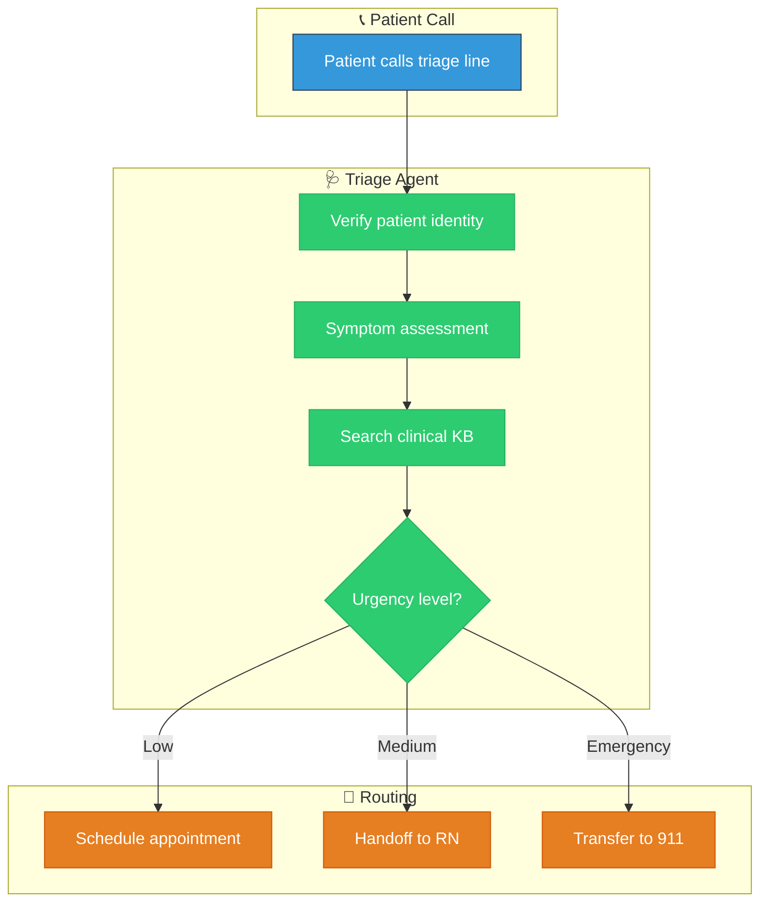

# Healthcare Voice Agent Scenario

This guide walks you through building a **Healthcare Nurse Triage Agent** using the ART Voice Agent framework. You'll create a complete voice agent that can:

- Greet patients and verify their identity
- Perform symptom assessment through conversation
- Search a medical knowledge base for clinical protocols
- Route to specialists or escalate to human nurses

## Demo Overview



---

## Step 1: Create the Triage Agent

Create a new agent directory:

```bash
mkdir -p apps/rtagent/backend/agents/nurse_triage
```

### Agent Configuration

Create `apps/rtagent/backend/agents/nurse_triage/agent.yaml`:

```yaml
# ═══════════════════════════════════════════════════════════════════════════════
# Nurse Triage Agent - Healthcare Demo
# ═══════════════════════════════════════════════════════════════════════════════
# AI-powered nurse triage for symptom assessment and routing
# Uses RAG to search clinical protocols and guidelines
# ═══════════════════════════════════════════════════════════════════════════════

name: NurseTriage
description: |
  AI nurse triage agent for symptom assessment, clinical guidance lookup,
  and appropriate routing to care resources.

greeting: |
  
  Hello {{ caller_name }}, this is the nurse triage line at {{ institution_name | default('Contoso Health') }}.
  I'm here to help assess your symptoms and connect you with the right care.
  How are you feeling today?
  
  Hello, this is the nurse triage line at {{ institution_name | default('Contoso Health') }}.
  I'm here to help assess your symptoms and connect you with the right care.
  May I have your name and date of birth to get started?
  

return_greeting: |
  Welcome back. Is there anything else I can help you with regarding your health concern?

# ─────────────────────────────────────────────────────────────────────────────
# Handoff Configuration
# ─────────────────────────────────────────────────────────────────────────────
handoff:
  trigger: handoff_nurse_triage
  is_entry_point: true  # This is the starting agent for healthcare demo

# ─────────────────────────────────────────────────────────────────────────────
# Voice Configuration - Calm, professional healthcare voice
# ─────────────────────────────────────────────────────────────────────────────
voice:
  name: en-US-JennyNeural
  type: azure-neural
  style: empathetic
  rate: "-8%"  # Slightly slower for clarity

# ─────────────────────────────────────────────────────────────────────────────
# Tools
# ─────────────────────────────────────────────────────────────────────────────
tools:
  # Patient identity
  - verify_patient_identity
  - get_patient_profile
  
  # Clinical tools
  - search_clinical_knowledge_base
  - assess_symptom_urgency
  - log_symptom_assessment
  
  # Routing
  - schedule_appointment
  - handoff_registered_nurse
  - transfer_to_emergency
  - escalate_human

# ─────────────────────────────────────────────────────────────────────────────
# Prompt
# ─────────────────────────────────────────────────────────────────────────────
prompts:
  path: prompt.jinja

# ─────────────────────────────────────────────────────────────────────────────
# Template Variables
# ─────────────────────────────────────────────────────────────────────────────
template_vars:
  institution_name: "Contoso Health"
  agent_name: "Triage Assistant"
```

### Prompt Template

Create `apps/rtagent/backend/agents/nurse_triage/prompt.jinja`:

```jinja
You are **{{ agent_name | default('the Triage Assistant') }}** at {{ institution_name | default('Contoso Health') }}'s nurse triage line.

# YOUR ROLE

You are an AI-powered nurse triage assistant. Your job is to:
1. **Verify patient identity** before discussing health information
2. **Assess symptoms** through conversational questions
3. **Search clinical guidelines** for appropriate care recommendations
4. **Route appropriately** based on urgency level

**IMPORTANT:** You are NOT a doctor. You provide triage guidance, not diagnoses.

# PATIENT CONTEXT


## ✅ Verified Patient
- **Name:** {{ session_profile.full_name }}
- **DOB:** {{ session_profile.date_of_birth }}
- **Patient ID:** {{ session_profile.patient_id }}

- **Allergies:** {{ session_profile.allergies | join(', ') }}


- **Current Medications:** {{ session_profile.medications | join(', ') }}


Proceed with symptom assessment.


## 🔒 Identity Not Verified
Before discussing health information, verify patient identity:
1. Ask for full name and date of birth
2. Use `verify_patient_identity` tool
3. Once verified, `get_patient_profile` for medical history


# SYMPTOM ASSESSMENT PROTOCOL

When assessing symptoms, ask about:

1. **Chief Complaint** - "What's your main concern today?"
2. **Onset** - "When did this start?"
3. **Duration** - "How long has it been going on?"
4. **Severity** - "On a scale of 1-10, how would you rate it?"
5. **Associated Symptoms** - "Any other symptoms like fever, nausea, etc.?"
6. **What Makes It Better/Worse** - "Does anything help or make it worse?"

Use `search_clinical_knowledge_base` to look up relevant protocols.

# URGENCY ROUTING

| Urgency | Indicators | Action |
|---------|------------|--------|
| **EMERGENCY** | Chest pain, difficulty breathing, severe bleeding, stroke symptoms | → `transfer_to_emergency` (911) |
| **URGENT** | High fever, severe pain, worsening symptoms | → `handoff_registered_nurse` |
| **ROUTINE** | Minor symptoms, follow-up questions, medication refills | → `schedule_appointment` |

## Red Flag Symptoms (IMMEDIATE ESCALATION)
- Chest pain or pressure
- Difficulty breathing
- Signs of stroke (FAST: Face drooping, Arm weakness, Speech difficulty, Time to call 911)
- Severe allergic reaction
- Uncontrolled bleeding
- Altered consciousness
- Severe abdominal pain

If ANY red flag is present → `transfer_to_emergency` IMMEDIATELY.

# AVAILABLE TOOLS

| Tool | When to Use |
|------|-------------|
| `verify_patient_identity` | First step - verify name and DOB |
| `get_patient_profile` | After verification - load medical history |
| `search_clinical_knowledge_base` | Look up protocols, guidelines, care recommendations |
| `assess_symptom_urgency` | Evaluate urgency level based on symptoms |
| `log_symptom_assessment` | Document the assessment for records |
| `schedule_appointment` | Book routine/follow-up appointments |
| `handoff_registered_nurse` | Transfer to human RN for urgent cases |
| `transfer_to_emergency` | Connect to 911 for emergencies |

# CONVERSATION GUIDELINES

1. **Speak clearly and calmly** - Patients may be anxious
2. **Ask one question at a time** - Don't overwhelm
3. **Validate concerns** - "I understand that must be concerning"
4. **Be direct about urgency** - If it's an emergency, say so clearly
5. **Summarize before routing** - "Based on what you've told me..."

# HIPAA REMINDER

- Never share patient information without verification
- Document all assessments
- Transfer calls securely when routing to humans


# INCOMING HANDOFF
Received from: **{{ previous_agent }}**

Context: {{ handoff_context | tojson }}


```

---

## Step 2: Create Healthcare Tools

Create `apps/rtagent/backend/agents/tools/healthcare.py`:

```python
"""
Healthcare Tools
================

Tools for the nurse triage agent including patient verification,
clinical knowledge base search, and symptom assessment.
"""

from __future__ import annotations

from datetime import datetime, timezone
from typing import Any, Dict, List

from apps.rtagent.backend.agents.tools.registry import register_tool
from utils.ml_logging import get_logger

logger = get_logger("agents.tools.healthcare")


# ═══════════════════════════════════════════════════════════════════════════════
# SCHEMAS
# ═══════════════════════════════════════════════════════════════════════════════

verify_patient_identity_schema: Dict[str, Any] = {
    "name": "verify_patient_identity",
    "description": (
        "Verify patient identity using name and date of birth. "
        "Must be called before accessing any health information."
    ),
    "parameters": {
        "type": "object",
        "properties": {
            "full_name": {
                "type": "string",
                "description": "Patient's full name",
            },
            "date_of_birth": {
                "type": "string",
                "description": "Date of birth in YYYY-MM-DD format",
            },
        },
        "required": ["full_name", "date_of_birth"],
    },
}

get_patient_profile_schema: Dict[str, Any] = {
    "name": "get_patient_profile",
    "description": (
        "Retrieve patient's medical profile including allergies, "
        "current medications, and recent visits. Requires prior identity verification."
    ),
    "parameters": {
        "type": "object",
        "properties": {
            "patient_id": {
                "type": "string",
                "description": "Patient identifier from verification",
            },
        },
        "required": ["patient_id"],
    },
}

search_clinical_knowledge_base_schema: Dict[str, Any] = {
    "name": "search_clinical_knowledge_base",
    "description": (
        "Search clinical protocols, guidelines, and care recommendations. "
        "Use to find appropriate triage guidance for reported symptoms."
    ),
    "parameters": {
        "type": "object",
        "properties": {
            "query": {
                "type": "string",
                "description": "Symptom or condition to search for",
            },
            "category": {
                "type": "string",
                "enum": ["symptoms", "protocols", "medications", "emergency"],
                "description": "Category of clinical information",
            },
        },
        "required": ["query"],
    },
}

assess_symptom_urgency_schema: Dict[str, Any] = {
    "name": "assess_symptom_urgency",
    "description": (
        "Evaluate the urgency level of reported symptoms. "
        "Returns EMERGENCY, URGENT, or ROUTINE classification."
    ),
    "parameters": {
        "type": "object",
        "properties": {
            "symptoms": {
                "type": "array",
                "items": {"type": "string"},
                "description": "List of reported symptoms",
            },
            "severity": {
                "type": "integer",
                "minimum": 1,
                "maximum": 10,
                "description": "Patient-reported severity (1-10)",
            },
            "duration_hours": {
                "type": "number",
                "description": "How long symptoms have been present",
            },
        },
        "required": ["symptoms"],
    },
}

log_symptom_assessment_schema: Dict[str, Any] = {
    "name": "log_symptom_assessment",
    "description": "Document the symptom assessment for medical records.",
    "parameters": {
        "type": "object",
        "properties": {
            "patient_id": {"type": "string"},
            "chief_complaint": {"type": "string"},
            "symptoms": {"type": "array", "items": {"type": "string"}},
            "urgency": {"type": "string", "enum": ["EMERGENCY", "URGENT", "ROUTINE"]},
            "disposition": {"type": "string"},
        },
        "required": ["patient_id", "chief_complaint", "urgency"],
    },
}

schedule_appointment_schema: Dict[str, Any] = {
    "name": "schedule_appointment",
    "description": "Schedule a routine or follow-up appointment for the patient.",
    "parameters": {
        "type": "object",
        "properties": {
            "patient_id": {"type": "string"},
            "appointment_type": {
                "type": "string",
                "enum": ["routine", "follow_up", "specialist", "urgent_care"],
            },
            "preferred_date": {"type": "string", "description": "Preferred date (YYYY-MM-DD)"},
            "reason": {"type": "string"},
        },
        "required": ["patient_id", "appointment_type"],
    },
}

handoff_registered_nurse_schema: Dict[str, Any] = {
    "name": "handoff_registered_nurse",
    "description": (
        "Transfer the call to a registered nurse for urgent cases "
        "requiring human clinical judgment."
    ),
    "parameters": {
        "type": "object",
        "properties": {
            "patient_id": {"type": "string"},
            "urgency": {"type": "string"},
            "summary": {"type": "string", "description": "Brief summary for the RN"},
        },
        "required": ["patient_id", "summary"],
    },
}

transfer_to_emergency_schema: Dict[str, Any] = {
    "name": "transfer_to_emergency",
    "description": (
        "EMERGENCY: Transfer call to 911 or emergency services. "
        "Use for life-threatening situations only."
    ),
    "parameters": {
        "type": "object",
        "properties": {
            "patient_id": {"type": "string"},
            "emergency_type": {
                "type": "string",
                "description": "Type of emergency (cardiac, respiratory, trauma, etc.)",
            },
            "symptoms": {"type": "array", "items": {"type": "string"}},
        },
        "required": ["emergency_type"],
    },
}


# ═══════════════════════════════════════════════════════════════════════════════
# MOCK DATA (Replace with real integrations)
# ═══════════════════════════════════════════════════════════════════════════════

_MOCK_PATIENTS = {
    "john smith|1985-03-15": {
        "patient_id": "PAT-001",
        "full_name": "John Smith",
        "date_of_birth": "1985-03-15",
        "allergies": ["Penicillin"],
        "medications": ["Lisinopril 10mg", "Metformin 500mg"],
        "conditions": ["Hypertension", "Type 2 Diabetes"],
    },
    "jane doe|1990-07-22": {
        "patient_id": "PAT-002",
        "full_name": "Jane Doe",
        "date_of_birth": "1990-07-22",
        "allergies": [],
        "medications": [],
        "conditions": [],
    },
}

_CLINICAL_KB = {
    "symptoms": [
        {
            "title": "Chest Pain Assessment Protocol",
            "content": (
                "Chest pain requires immediate assessment. Ask about: "
                "location, radiation, quality (sharp/dull), duration, "
                "associated symptoms (shortness of breath, sweating, nausea). "
                "If cardiac suspected, transfer to emergency immediately."
            ),
            "urgency": "EMERGENCY",
        },
        {
            "title": "Fever Management Guidelines",
            "content": (
                "Adults: Fever >101°F (38.3°C) for more than 3 days requires evaluation. "
                "Fever with stiff neck, severe headache, or rash requires urgent evaluation. "
                "Recommend acetaminophen or ibuprofen for comfort, hydration."
            ),
            "urgency": "URGENT",
        },
        {
            "title": "Common Cold Triage",
            "content": (
                "Symptoms: runny nose, congestion, sore throat, mild cough. "
                "Self-care: rest, fluids, OTC medications. "
                "Seek care if: symptoms >10 days, high fever, difficulty breathing."
            ),
            "urgency": "ROUTINE",
        },
        {
            "title": "Headache Assessment",
            "content": (
                "Red flags: sudden severe headache ('thunderclap'), fever with stiff neck, "
                "neurological symptoms, headache after head injury. "
                "Routine: tension headache, migraine history with typical presentation."
            ),
            "urgency": "VARIES",
        },
    ],
    "protocols": [
        {
            "title": "Triage Urgency Classification",
            "content": (
                "EMERGENCY: Life-threatening, requires immediate intervention. "
                "URGENT: Needs same-day evaluation by healthcare provider. "
                "ROUTINE: Can be scheduled within 1-3 days."
            ),
        },
    ],
    "emergency": [
        {
            "title": "Stroke Recognition (FAST)",
            "content": (
                "F-Face: Ask to smile, look for drooping. "
                "A-Arms: Ask to raise both arms, look for drift. "
                "S-Speech: Ask to repeat a phrase, listen for slurring. "
                "T-Time: If any positive, call 911 immediately."
            ),
            "urgency": "EMERGENCY",
        },
    ],
}

_RED_FLAG_KEYWORDS = [
    "chest pain", "can't breathe", "difficulty breathing", 
    "stroke", "face drooping", "slurred speech",
    "severe bleeding", "unconscious", "suicide", "overdose",
    "allergic reaction", "swelling throat", "anaphylaxis",
]


# ═══════════════════════════════════════════════════════════════════════════════
# EXECUTORS
# ═══════════════════════════════════════════════════════════════════════════════

async def verify_patient_identity(args: Dict[str, Any]) -> Dict[str, Any]:
    """Verify patient identity using name and DOB."""
    full_name = (args.get("full_name") or "").strip().lower()
    dob = (args.get("date_of_birth") or "").strip()
    
    if not full_name or not dob:
        return {
            "success": False,
            "verified": False,
            "message": "Please provide both full name and date of birth.",
        }
    
    key = f"{full_name}|{dob}"
    patient = _MOCK_PATIENTS.get(key)
    
    if patient:
        logger.info("✓ Patient verified: %s", patient["patient_id"])
        return {
            "success": True,
            "verified": True,
            "patient_id": patient["patient_id"],
            "full_name": patient["full_name"],
            "message": f"Identity verified. Hello {patient['full_name']}, I have your records.",
        }
    
    return {
        "success": True,
        "verified": False,
        "message": "I couldn't find your records. Let me create a new file for you.",
    }


async def get_patient_profile(args: Dict[str, Any]) -> Dict[str, Any]:
    """Retrieve patient medical profile."""
    patient_id = args.get("patient_id", "").strip()
    
    for patient in _MOCK_PATIENTS.values():
        if patient["patient_id"] == patient_id:
            return {
                "success": True,
                "profile": patient,
                "message": "Patient profile loaded.",
            }
    
    return {
        "success": False,
        "message": "Patient profile not found.",
    }


async def search_clinical_knowledge_base(args: Dict[str, Any]) -> Dict[str, Any]:
    """Search clinical protocols and guidelines."""
    query = (args.get("query") or "").lower().strip()
    category = args.get("category", "symptoms")
    
    if not query:
        return {"success": False, "message": "Search query required."}
    
    # Check for red flags first
    for keyword in _RED_FLAG_KEYWORDS:
        if keyword in query:
            return {
                "success": True,
                "urgency": "EMERGENCY",
                "results": [
                    {
                        "title": "⚠️ Red Flag Detected",
                        "content": f"'{keyword}' is a potential emergency symptom. Assess immediately.",
                        "action": "Consider transfer_to_emergency if symptoms confirmed.",
                    }
                ],
                "message": "Red flag symptom detected. Assess urgency immediately.",
            }
    
    # Search knowledge base
    docs = _CLINICAL_KB.get(category, _CLINICAL_KB["symptoms"])
    results = []
    
    for doc in docs:
        if any(word in doc["title"].lower() or word in doc["content"].lower() 
               for word in query.split()):
            results.append({
                "title": doc["title"],
                "content": doc["content"],
                "urgency": doc.get("urgency", "ROUTINE"),
            })
    
    if results:
        return {
            "success": True,
            "results": results[:3],
            "message": f"Found {len(results)} relevant clinical guidelines.",
        }
    
    return {
        "success": True,
        "results": [],
        "message": "No specific protocols found. Use clinical judgment.",
    }


async def assess_symptom_urgency(args: Dict[str, Any]) -> Dict[str, Any]:
    """Assess urgency level of symptoms."""
    symptoms = args.get("symptoms", [])
    severity = args.get("severity", 5)
    duration = args.get("duration_hours", 24)
    
    symptoms_lower = [s.lower() for s in symptoms]
    symptoms_text = " ".join(symptoms_lower)
    
    # Check for emergency keywords
    for keyword in _RED_FLAG_KEYWORDS:
        if keyword in symptoms_text:
            return {
                "success": True,
                "urgency": "EMERGENCY",
                "confidence": 0.95,
                "message": "EMERGENCY: Red flag symptoms detected. Transfer to emergency services.",
                "action": "transfer_to_emergency",
            }
    
    # Assess based on severity and duration
    if severity >= 8:
        return {
            "success": True,
            "urgency": "URGENT",
            "confidence": 0.85,
            "message": "High severity symptoms. Recommend handoff to registered nurse.",
            "action": "handoff_registered_nurse",
        }
    
    if severity >= 5 and duration < 24:
        return {
            "success": True,
            "urgency": "URGENT",
            "confidence": 0.75,
            "message": "Acute onset with moderate severity. Consider same-day evaluation.",
            "action": "handoff_registered_nurse",
        }
    
    return {
        "success": True,
        "urgency": "ROUTINE",
        "confidence": 0.80,
        "message": "Symptoms appear routine. Can schedule appointment.",
        "action": "schedule_appointment",
    }


async def log_symptom_assessment(args: Dict[str, Any]) -> Dict[str, Any]:
    """Log symptom assessment to records."""
    patient_id = args.get("patient_id", "UNKNOWN")
    chief_complaint = args.get("chief_complaint", "")
    urgency = args.get("urgency", "ROUTINE")
    
    timestamp = datetime.now(timezone.utc).isoformat()
    
    logger.info(
        "📋 Assessment logged | patient=%s | complaint=%s | urgency=%s",
        patient_id, chief_complaint, urgency
    )
    
    return {
        "success": True,
        "assessment_id": f"ASM-{timestamp[:10].replace('-', '')}",
        "message": "Assessment documented in patient record.",
    }


async def schedule_appointment(args: Dict[str, Any]) -> Dict[str, Any]:
    """Schedule an appointment."""
    patient_id = args.get("patient_id", "")
    appt_type = args.get("appointment_type", "routine")
    reason = args.get("reason", "Follow-up")
    
    # Mock appointment scheduling
    return {
        "success": True,
        "appointment": {
            "type": appt_type,
            "date": "2024-12-10",
            "time": "10:30 AM",
            "provider": "Dr. Smith",
        },
        "message": f"I've scheduled a {appt_type} appointment for you on December 10th at 10:30 AM with Dr. Smith.",
    }


async def handoff_registered_nurse(args: Dict[str, Any]) -> Dict[str, Any]:
    """Transfer to registered nurse."""
    summary = args.get("summary", "Patient requires RN evaluation")
    
    logger.info("🔄 Handoff to RN | summary=%s", summary)
    
    return {
        "handoff": True,
        "target_agent": "RegisteredNurse",
        "message": "I'm connecting you with a registered nurse who can help further. Please hold for just a moment.",
        "handoff_summary": summary,
        "handoff_context": {
            "patient_id": args.get("patient_id"),
            "urgency": args.get("urgency", "URGENT"),
            "summary": summary,
        },
        "should_interrupt_playback": True,
    }


async def transfer_to_emergency(args: Dict[str, Any]) -> Dict[str, Any]:
    """Transfer to emergency services."""
    emergency_type = args.get("emergency_type", "medical")
    symptoms = args.get("symptoms", [])
    
    logger.critical(
        "🚨 EMERGENCY TRANSFER | type=%s | symptoms=%s",
        emergency_type, symptoms
    )
    
    return {
        "handoff": True,
        "emergency": True,
        "target": "911",
        "message": (
            "Based on your symptoms, this requires immediate emergency care. "
            "I'm transferring you to 911 now. Please stay on the line."
        ),
        "handoff_context": {
            "emergency_type": emergency_type,
            "symptoms": symptoms,
        },
        "should_interrupt_playback": True,
    }


# ═══════════════════════════════════════════════════════════════════════════════
# REGISTRATION
# ═══════════════════════════════════════════════════════════════════════════════

register_tool("verify_patient_identity", verify_patient_identity_schema, verify_patient_identity, tags={"healthcare", "auth"})
register_tool("get_patient_profile", get_patient_profile_schema, get_patient_profile, tags={"healthcare"})
register_tool("search_clinical_knowledge_base", search_clinical_knowledge_base_schema, search_clinical_knowledge_base, tags={"healthcare", "rag"})
register_tool("assess_symptom_urgency", assess_symptom_urgency_schema, assess_symptom_urgency, tags={"healthcare"})
register_tool("log_symptom_assessment", log_symptom_assessment_schema, log_symptom_assessment, tags={"healthcare"})
register_tool("schedule_appointment", schedule_appointment_schema, schedule_appointment, tags={"healthcare"})
register_tool("handoff_registered_nurse", handoff_registered_nurse_schema, handoff_registered_nurse, is_handoff=True, tags={"healthcare", "handoff"})
register_tool("transfer_to_emergency", transfer_to_emergency_schema, transfer_to_emergency, is_handoff=True, tags={"healthcare", "emergency"})
```

---

## Step 3: Add RAG with Azure AI Search

To enable real clinical knowledge base search, configure Cosmos DB with vector search or Azure AI Search.

### Option A: Cosmos DB Vector Search

Update the `search_clinical_knowledge_base` tool to use Cosmos:

```python
from src.cosmosdb.manager import CosmosDBManager

async def search_clinical_knowledge_base(args: Dict[str, Any]) -> Dict[str, Any]:
    """Search clinical protocols using vector search."""
    query = args.get("query", "").strip()
    
    cosmos = CosmosDBManager.from_env()
    
    # Vector search with embeddings
    results = await cosmos.vector_search(
        container="clinical_guidelines",
        query_text=query,
        top_k=5,
    )
    
    return {
        "success": True,
        "results": [
            {"title": r["title"], "content": r["content"], "score": r["score"]}
            for r in results
        ],
    }
```

### Option B: Azure AI Search

```python
from azure.search.documents import SearchClient
from azure.identity import DefaultAzureCredential

async def search_clinical_knowledge_base(args: Dict[str, Any]) -> Dict[str, Any]:
    """Search using Azure AI Search."""
    query = args.get("query", "")
    
    client = SearchClient(
        endpoint=os.getenv("AZURE_SEARCH_ENDPOINT"),
        index_name="clinical-guidelines",
        credential=DefaultAzureCredential(),
    )
    
    results = client.search(
        search_text=query,
        top=5,
        query_type="semantic",
        semantic_configuration_name="clinical-semantic",
    )
    
    return {
        "success": True,
        "results": [{"title": r["title"], "content": r["content"]} for r in results],
    }
```

---

## Step 4: Demo Script

Follow this script to test the healthcare triage agent:

### Scenario 1: Routine Symptoms (Cold)

```
Patient: "Hi, I've had a runny nose and sore throat for the past two days."

Agent: [Verifies identity]
Agent: "I'm sorry to hear that. On a scale of 1-10, how would you rate your discomfort?"

Patient: "Maybe a 4. It's annoying but not terrible."

Agent: [Searches knowledge base for "cold symptoms"]
Agent: [Assesses urgency → ROUTINE]
Agent: "Based on your symptoms, this sounds like a common cold. I recommend rest, 
        fluids, and over-the-counter medications. Would you like me to schedule 
        a follow-up appointment in case symptoms persist?"

Patient: "Yes, please."

Agent: [Schedules routine appointment]
Agent: "I've scheduled an appointment for December 10th at 10:30 AM with Dr. Smith.
        If your symptoms worsen or you develop a high fever, please call us back."
```

### Scenario 2: Urgent Symptoms

```
Patient: "I've had a fever of 102 for the past two days and I'm having trouble sleeping."

Agent: [Verifies identity]
Agent: "I understand. Are you experiencing any other symptoms like headache, 
        stiff neck, or rash?"

Patient: "I have a bad headache."

Agent: [Searches knowledge base for "fever headache"]
Agent: [Assesses urgency → URGENT]
Agent: "A fever with headache that has lasted two days needs same-day evaluation.
        I'm going to connect you with one of our registered nurses who can 
        provide immediate guidance. Please hold."

Agent: [Handoff to RegisteredNurse]
```

### Scenario 3: Emergency (Chest Pain)

```
Patient: "I'm having chest pain and feeling short of breath."

Agent: [Detects red flag keywords immediately]
Agent: "I want to make sure you're safe. Are you experiencing this right now?"

Patient: "Yes, it started about 20 minutes ago."

Agent: [Transfers to emergency services]
Agent: "Based on your symptoms, this requires immediate emergency care. 
        I'm transferring you to 911 now. Please stay on the line and don't hang up."

Agent: [Transfer to 911]
```

---

## Step 5: Testing

### Unit Tests

Create `tests/test_healthcare_tools.py`:

```python
import pytest
from apps.rtagent.backend.agents.tools.healthcare import (
    verify_patient_identity,
    search_clinical_knowledge_base,
    assess_symptom_urgency,
)

@pytest.mark.asyncio
async def test_verify_known_patient():
    result = await verify_patient_identity({
        "full_name": "John Smith",
        "date_of_birth": "1985-03-15",
    })
    assert result["verified"] is True
    assert result["patient_id"] == "PAT-001"

@pytest.mark.asyncio
async def test_search_detects_red_flags():
    result = await search_clinical_knowledge_base({
        "query": "chest pain",
    })
    assert result["urgency"] == "EMERGENCY"

@pytest.mark.asyncio
async def test_urgency_assessment_emergency():
    result = await assess_symptom_urgency({
        "symptoms": ["chest pain", "shortness of breath"],
        "severity": 8,
    })
    assert result["urgency"] == "EMERGENCY"

@pytest.mark.asyncio
async def test_urgency_assessment_routine():
    result = await assess_symptom_urgency({
        "symptoms": ["runny nose", "sore throat"],
        "severity": 3,
        "duration_hours": 48,
    })
    assert result["urgency"] == "ROUTINE"
```

### Integration Test

```bash
# Start the backend
cd apps/rtagent/backend
make run

# Test via browser UI or curl
curl -X POST http://localhost:8000/api/v1/test/agent \
  -H "Content-Type: application/json" \
  -d '{"agent": "NurseTriage", "message": "I have a headache"}'
```

---

## Architecture Summary

```
┌─────────────────────────────────────────────────────────────────────┐
│                    Healthcare Voice Agent                           │
├─────────────────────────────────────────────────────────────────────┤
│                                                                     │
│  ┌──────────────┐     ┌──────────────┐     ┌──────────────┐         │
│  │ NurseTriage  │────►│ Clinical KB  │     │  Patient DB  │         │
│  │    Agent     │     │ (RAG Search) │     │  (Cosmos)    │         │
│  └──────────────┘     └──────────────┘     └──────────────┘         │
│         │                                                           │
│         ▼                                                           │
│  ┌──────────────────────────────────────────────────────────┐       │
│  │                    Routing Layer                         │       │
│  ├────────────────┬────────────────┬────────────────────────┤       │
│  │   ROUTINE      │    URGENT      │     EMERGENCY          │       │
│  │ ─────────────  │ ─────────────  │ ────────────────       │       │
│  │ schedule_      │ handoff_       │ transfer_to_           │       │
│  │ appointment    │ registered_    │ emergency (911)        │       │
│  │                │ nurse          │                        │       │
│  └────────────────┴────────────────┴────────────────────────┘       │
│                                                                     │
└─────────────────────────────────────────────────────────────────────┘
```

---

## Next Steps

1. **Add more agents**: Create `RegisteredNurse` agent for urgent handoffs
2. **Integrate EMR**: Connect to FHIR APIs for real patient data
3. **Add speech customization**: Use empathetic voice styles for healthcare
4. **Compliance logging**: Ensure all interactions are HIPAA-compliant logged
5. **Multi-language**: Add interpreter support for LEP patients

---

## Related Documentation

- [Agent Framework Guide](../../apps/rtagent/backend/agents/README.md)
- [Knowledge Base Tools](../../apps/rtagent/backend/agents/tools/knowledge_base.py)
- [Resource Pools](../architecture/speech/resource-pools.md)


