# Insurance Voice Agent Scenario

This guide explains the **Insurance Customer Service Scenario** — a security-focused multi-agent voice system designed for claims processing, fraud detection, and policy management. You'll learn how the scenario orchestrates agent handoffs to balance security with customer experience.

---

## Business Value

| Capability | Business Impact |
|------------|-----------------|
| **First Notice of Loss (FNOL)** | Capture claims at first contact, reduce cycle time |
| **Subrogation Recovery** | Automate fault liability and payment tracking |
| **Policy Management** | Self-service policy inquiries, reduce call volume |
| **Fraud Detection** | Route suspicious claims for investigation |
| **Secure Authentication** | Verify caller identity before disclosing PII |

---

## Scenario Overview

The insurance scenario demonstrates a **security-first model** where authentication is the entry point, with fraud detection as a key specialist. This pattern is common in industries where identity verification is critical before any service delivery.


---

## Quick Start

To use the insurance scenario, specify it when starting a call session:

```python
from registries.scenariostore.loader import (
    load_scenario,
    get_scenario_agents,
    build_handoff_map_from_scenario,
)

# Load the insurance scenario
scenario = load_scenario("insurance")

# Get agents configured for insurance
agents = get_scenario_agents("insurance")

# Build handoff routing
handoff_map = build_handoff_map_from_scenario("insurance")
# → {"handoff_fraud_agent": "FraudAgent", "handoff_to_auth": "AuthAgent"}
```

---

## Understanding the Scenario Configuration

The insurance scenario is defined in a single YAML file:

```yaml title="registries/scenariostore/insurance/scenario.yaml"
# Insurance Customer Service Scenario
# Optimized for insurance claims, policy management, and customer support

name: insurance
description: Insurance customer service with claims processing and policy management

# Starting agent - authentication first!
start_agent: AuthAgent

# Agents participating in this scenario
agents:
  - AuthAgent
  - FraudAgent

# Default handoff behavior
handoff_type: announced

# Handoff routes
handoffs:
  # Auth routes to Fraud specialist
  - from: AuthAgent
    to: FraudAgent
    tool: handoff_fraud_agent
    type: announced           # Fraud is sensitive - always announce
    share_context: true

  # Fraud returns to Auth
  - from: FraudAgent
    to: AuthAgent
    tool: handoff_to_auth
    type: discrete            # Returning after fraud check - seamless
    share_context: true

# Template variables for all agents
agent_defaults:
  company_name: "Insurance Services"
  industry: "insurance"
  compliance_required: true
  region: "US"
  claims_processing: true
```

---

## Scenario Components Explained

### 1. Entry Point: `start_agent`

```yaml
start_agent: AuthAgent
```

Unlike banking, the insurance scenario starts with **AuthAgent**. This reflects the security-first nature of insurance — customers must verify their identity before accessing any policy or claims information.

!!! warning "Security-First Design"
    Insurance data is highly regulated (HIPAA for health insurance, state regulations for P&C). Starting with authentication ensures compliance and protects customer data.

### 2. Agent Selection: `agents`

```yaml
agents:
  - AuthAgent
  - FraudAgent
```

This is a focused scenario with only 2 agents:

| Agent | Purpose |
|-------|---------|
| **AuthAgent** | Identity verification, primary service for authenticated customers |
| **FraudAgent** | Specialized fraud investigation for suspicious claims or activity |

!!! tip "Minimal Agent Set"
    By limiting agents to what's needed, you reduce complexity and improve response times. The AuthAgent handles most requests; FraudAgent is a specialist.

### 3. Handoff Routes: `handoffs`

The insurance scenario has a simple, secure handoff pattern:

```yaml
handoffs:
  # Forward: Auth → Fraud (when suspicious activity detected)
  - from: AuthAgent
    to: FraudAgent
    tool: handoff_fraud_agent
    type: announced           # Explicit - customer knows they're with fraud team
    share_context: true

  # Return: Fraud → Auth (after investigation)
  - from: FraudAgent
    to: AuthAgent
    tool: handoff_to_auth
    type: discrete            # Seamless return
    share_context: true
```

#### Why Announced for Fraud?

Fraud handoffs are `announced` because:

1. **Transparency** — Customers should know they're speaking with a fraud specialist
2. **Legal protection** — Clear handoff is documented in call records
3. **Trust building** — Explicit acknowledgment builds confidence in the process

#### Why Discrete for Return?

The return to AuthAgent is `discrete` because:

1. **Continuity** — The fraud check is complete, normal service resumes
2. **Efficiency** — No need for another formal introduction
3. **Customer experience** — Feels like one continuous call

### 4. Template Variables: `agent_defaults`

```yaml
agent_defaults:
  company_name: "Insurance Services"
  industry: "insurance"
  compliance_required: true
  region: "US"
  claims_processing: true
```

The `claims_processing: true` variable can enable claims-specific tools and prompts:

```jinja title="In agent prompts"

You can help customers with:
- Filing new claims
- Checking claim status
- Uploading claim documents

```

---

## Agent Graph Visualization

The insurance scenario creates this focused agent routing graph:

```mermaid
flowchart LR
    subgraph Legend[" "]
        direction LR
        L1[Agent A] ==>|"🔔 ANNOUNCED"| L2[Agent B]
        L3[Agent C] -.->|"🔇 DISCRETE"| L4[Agent D]
    end

    subgraph Insurance["Insurance Scenario"]
        A["🔐 AuthAgent<br/>(entry point)"]
        F["🚨 FraudAgent<br/>(specialist)"]
        
        A ==>|"🔔 announced<br/>handoff_fraud_agent"| F
        F -.->|"🔇 discrete<br/>handoff_to_auth"| A
    end

    style A fill:#e74c3c,stroke:#c0392b,color:#fff
    style F fill:#9b59b6,stroke:#8e44ad,color:#fff
    style L1 fill:#fff,stroke:#999
    style L2 fill:#fff,stroke:#999
    style L3 fill:#fff,stroke:#999
    style L4 fill:#fff,stroke:#999
```



**Reading the Graph:**

| Line Style | Handoff Type | User Experience |
|------------|--------------|------------------|
| **Thick solid** (==>) | `announced` | Target agent greets customer explicitly |
| **Dashed** (-->) | `discrete` | Seamless transition, no greeting |

**Key Observations:**

- **Two-node graph** — Simple, focused architecture
- **Bidirectional** — Clear forward and return paths
- **AuthAgent is hub** — All paths go through authentication
- **Asymmetric types** — Forward is announced, return is discrete

---

## Customer Journey Examples

### Journey 1: Fraud Investigation

```mermaid
sequenceDiagram
    participant C as 👤 Customer
    participant Auth as 🔐 AuthAgent
    participant Fraud as 🚨 FraudAgent

    C->>Auth: "Hi, I need to report a suspicious charge"
    Auth->>C: "I can help with that. Let me verify your identity first."
    Auth->>C: "What's your policy number and date of birth?"
    C->>Auth: "Policy ABC123, DOB 03/15/1980"
    Note over Auth: Identity verified ✅
    Auth->>C: "Thank you, you're verified. You mentioned a suspicious charge?"
    C->>Auth: "Yes, there's a $5,000 claim I didn't file"
    Note over Auth: Detects fraud concern
    
    rect rgb(255, 235, 235)
        Note over Auth,Fraud: 🔔 ANNOUNCED handoff (explicit greeting)
        Auth->>Fraud: handoff_fraud_agent
        Fraud->>C: "You're now speaking with our Fraud Prevention desk."
    end
    
    Fraud->>C: "I can help investigate this unauthorized claim. When did you first notice?"
    C->>Fraud: "Just this morning when I checked my account"
    Fraud->>C: "I've flagged this as potentially fraudulent. Case #12345 is now open."
    
    rect rgb(230, 245, 230)
        Note over Fraud,Auth: 🔇 DISCRETE return (seamless)
        Fraud-->>Auth: handoff_to_auth
    end
    
    Auth->>C: "Is there anything else I can help you with today?"
```



### Journey 2: Policy Inquiry (No Handoff)


!!! note "AuthAgent Handles Most Requests"
    In this scenario, AuthAgent is the primary service agent after verification. FraudAgent is only needed for fraud-specific concerns.

---

## Comparing Banking vs Insurance Scenarios

| Aspect | Banking | Insurance |
|--------|---------|-----------|
| **Entry Point** | Concierge | AuthAgent |
| **Model** | Concierge-led (service first) | Security-first (auth first) |
| **Specialist Count** | 3 (Auth, Investment, Card) | 1 (Fraud) |
| **Hub Agent** | Concierge | AuthAgent |
| **Default Handoff** | Mixed (context-dependent) | Announced (security-focused) |
| **Primary Use Cases** | Wealth management, personalization | Claims, fraud, compliance |

### Visual Comparison

```mermaid
flowchart TB
    subgraph Banking["🏦 Banking Scenario"]
        BC[Concierge] --> BA[Auth]
        BC --> BI[Investment]
        BC --> BR[Card]
    end
    
    subgraph Insurance["🛡️ Insurance Scenario"]
        IA[AuthAgent] --> IF[FraudAgent]
    end
    
    style BC fill:#9b59b6
    style IA fill:#e74c3c
```



---

## Customizing the Insurance Scenario

### Adding a Claims Specialist

To add a dedicated `ClaimsAgent` for complex claims:

**Step 1:** Create the agent in `registries/agentstore/claims_agent/agent.yaml`

**Step 2:** Update the scenario:

```yaml title="registries/scenariostore/insurance/scenario.yaml"
agents:
  - AuthAgent
  - FraudAgent
  - ClaimsAgent              # Add new agent

handoffs:
  # Existing handoffs...
  
  # Add claims routes
  - from: AuthAgent
    to: ClaimsAgent
    tool: handoff_claims_agent
    type: discrete            # Seamless for routine claims
    share_context: true

  - from: ClaimsAgent
    to: AuthAgent
    tool: handoff_to_auth
    type: discrete

  # Claims might detect fraud
  - from: ClaimsAgent
    to: FraudAgent
    tool: handoff_fraud_agent
    type: announced           # Fraud is always announced
    share_context: true
```

**Step 3:** Add handoff tools to relevant agents

### Expanded Insurance Graph


---

## Best Practices for Insurance Scenarios

### 1. Authentication First

Always start with identity verification:

```yaml
start_agent: AuthAgent   # Never skip authentication
```

### 2. Announced for Sensitive Handoffs

Use `announced` when transferring to fraud or compliance:

```yaml
- from: AuthAgent
  to: FraudAgent
  tool: handoff_fraud_agent
  type: announced   # Customer knows they're with fraud team
```

### 3. Discrete for Routine Handoffs

Use `discrete` for normal service handoffs:

```yaml
- from: AuthAgent
  to: ClaimsAgent
  tool: handoff_claims_agent
  type: discrete    # Seamless claims assistance
```

### 4. Always Share Context

Insurance requires context for compliance:

```yaml
share_context: true   # Claims history, policy details flow through
```

### 5. Document All Paths

Ensure every specialist has a return path:

```yaml
- from: FraudAgent
  to: AuthAgent
  tool: handoff_to_auth
  type: discrete
```

---

## Testing the Scenario

```python
import pytest
from registries.scenariostore.loader import (
    load_scenario,
    build_handoff_map_from_scenario,
    get_handoff_config,
)

def test_insurance_scenario_loads():
    scenario = load_scenario("insurance")
    assert scenario.name == "insurance"
    assert scenario.start_agent == "AuthAgent"  # Security first!

def test_insurance_handoff_map():
    handoff_map = build_handoff_map_from_scenario("insurance")
    
    # Verify routes
    assert handoff_map["handoff_fraud_agent"] == "FraudAgent"
    assert handoff_map["handoff_to_auth"] == "AuthAgent"

def test_fraud_handoff_is_announced():
    cfg = get_handoff_config("insurance", "AuthAgent", "handoff_fraud_agent")
    assert cfg.type == "announced"  # Fraud is always announced

def test_return_handoff_is_discrete():
    cfg = get_handoff_config("insurance", "FraudAgent", "handoff_to_auth")
    assert cfg.type == "discrete"  # Return is seamless

def test_insurance_template_vars():
    scenario = load_scenario("insurance")
    # Claims processing should be enabled
    assert scenario.agent_defaults.get("claims_processing") == True
```

---

## Compliance Considerations

### HIPAA (Health Insurance)

For health insurance, add compliance variables:

```yaml
agent_defaults:
  hipaa_compliant: true
  phi_handling: "encrypted"
  audit_logging: true
```

### State Regulations

Different states have different insurance regulations:

```yaml
agent_defaults:
  region: "CA"               # California
  dol_regulations: true       # Department of Insurance compliance
  claims_processing_sla: 30   # Days to process claims
```

---

## Related Documentation

- [Agent Framework](../architecture/agents/README.md) — How agents are configured
- [Handoff Strategies](../architecture/agents/handoffs.md) — Deep dive on handoff patterns
- [Banking Scenario](banking.md) — Compare with banking use case
- [Healthcare Scenario](healthcare.md) — Another security-first pattern

---

## Test Scenarios

Use these scripts to validate the insurance scenario end-to-end.

### Scenario A: Claim Authentication (Claimant Calling)

!!! example "Persona: John, the claimant, calling about his auto claim after an accident"

| Turn | Caller Says | Agent Does | Tool Triggered |
|------|-------------|------------|----------------|
| 1 | "Hi, I have a claim I need to check on" | Asks for claim number | — |
| 2 | "Claim number CLM-2024-001234" | Looks up claim, asks verification | `verify_cc_caller` ✓ |
| 3 | "John Smith, last four 1234" | Verifies claimant identity | — |
| 4 | — | Loads claim profile | Session profile loaded |
| 5 | "What's the status of my claim?" | Retrieves claim status | `get_claim_status` ✓ |
| 6 | "When will I get paid?" | Checks payment info | `get_payment_status` ✓ |

**Business Rules Tested:**

- ✅ Must verify claimant before disclosing claim details
- ✅ SSN4 + name verification for identity
- ✅ Claim data from Cosmos DB `demo_metadata.claims`

---

### Scenario B: Subrogation Status Inquiry

!!! example "Persona: Maria, checking recovery status on her claim where other party was at fault"

| Turn | Caller Says | Agent Does | Tool Triggered |
|------|-------------|------------|----------------|
| 1 | [Verifies identity via claim number + SSN4] | Authenticates | `verify_cc_caller` ✓ |
| 2 | "What's the subrogation status?" | Retrieves subro details | `get_subrogation_status` ✓ |
| 3 | "What liability did you determine?" | Shows fault percentage | `get_liability_determination` ✓ |
| 4 | "Have any payments been made?" | Lists recovery payments | `get_recovery_payments` ✓ |

**Business Rules Tested:**

- ✅ Subrogation data includes `liability_percentage`
- ✅ Recovery payments tracked with dates and amounts
- ✅ Adverse party information available

---

### Scenario C: First Notice of Loss (FNOL)

!!! example "Persona: David, reporting a new accident"

| Turn | Caller Says | Agent Does | Tool Triggered |
|------|-------------|------------|----------------|
| 1 | "I need to file a claim, I was in an accident" | Routes to FNOL agent | Handoff |
| 2 | "What's your policy number?" | Caller provides | — |
| 3 | "POL-AUTO-789012" | Looks up policy | `lookup_policy` ✓ |
| 4 | "Tell me what happened" | Caller describes | — |
| 5 | "Another car rear-ended me at a stoplight" | Creates FNOL | `file_new_claim` ✓ |
| 6 | "Your claim number is CLM-2024-005678" | Confirms new claim | — |

**Business Rules Tested:**

- ✅ Policy lookup validates coverage
- ✅ FNOL creates new claim record
- ✅ Claim number assigned immediately

---

### Scenario D: Policy Inquiry (Multi-Policy Holder)

!!! example "Persona: Sarah, inquiring about multiple policies"

| Turn | Caller Says | Agent Does | Tool Triggered |
|------|-------------|------------|----------------|
| 1 | [Authenticates with policy number + SSN4] | Verifies identity | `verify_policy_holder` ✓ |
| 2 | "What policies do I have?" | Lists all policies | `get_all_policies` ✓ |
| 3 | "Tell me about my auto policy" | Gets policy details | `get_policy_details` ✓ |
| 4 | "What's my deductible?" | Shows coverage | `get_coverage_details` ✓ |
| 5 | "When is my premium due?" | Shows billing | `get_billing_info` ✓ |

**Business Rules Tested:**

- ✅ Multi-policy lookup by holder ID
- ✅ Coverage details include deductibles and limits
- ✅ Billing dates and amounts accessible

---

### Scenario E: Cross-Agent Handoff (Auth → Subro → FNOL)

!!! example "Persona: Complex journey across multiple specialists"

| Turn | Caller Says | Agent Does | Tool Triggered |
|------|-------------|------------|----------------|
| 1 | [Verifies identity] | Loads session | `verify_cc_caller` ✓ |
| 2 | "What's my subrogation status?" | Routes to Subro | Handoff |
| 3 | [Gets subro details] | Returns status | `get_subrogation_status` ✓ |
| 4 | "Actually, I had another accident yesterday" | Routes to FNOL | Handoff |
| 5 | [Files new claim] | Creates FNOL | `file_new_claim` ✓ |
| 6 | "That's all, thanks" | Returns to Auth | `handoff_to_auth` |

**Business Rules Tested:**

- ✅ Seamless cross-specialist handoffs
- ✅ Context preserved across agents
- ✅ Multiple claims per caller supported

---

## Agent Architecture

```mermaid
flowchart TD
    subgraph Entry["🔐 Authentication"]
        Auth[AuthAgent<br/>Entry Point]
    end

    subgraph Specialists["🛡️ Specialists"]
        Policy[PolicyAdvisor<br/>Policy inquiries]
        FNOL[FNOLAgent<br/>File new claims]
        Subro[SubroAgent<br/>Subrogation status]
    end

    Auth -->|"handoff_policy_advisor"| Policy
    Auth -->|"handoff_fnol_agent"| FNOL
    Auth -->|"handoff_subro_agent"| Subro
    Policy -->|"handoff_to_auth"| Auth
    FNOL -->|"handoff_to_auth"| Auth
    Subro -->|"handoff_to_auth"| Auth

    classDef auth fill:#e74c3c,stroke:#c0392b,color:#fff
    classDef specialist fill:#2ecc71,stroke:#27ae60,color:#fff

    class Auth auth
    class Policy,FNOL,Subro specialist
```



### Agent Roles

| Agent | Purpose | Tools |
|-------|---------|-------|
| **AuthAgent** | Identity verification, routing | `verify_cc_caller`, `verify_policy_holder` |
| **PolicyAdvisor** | Policy inquiries, coverage | `get_policy_details`, `get_coverage_details`, `get_billing_info` |
| **FNOLAgent** | File new claims | `lookup_policy`, `file_new_claim` |
| **SubroAgent** | Subrogation recovery | `get_subrogation_status`, `get_liability_determination`, `get_recovery_payments` |

---

## Tools Reference

### Authentication Tools

| Tool | Purpose |
|------|---------|
| `verify_cc_caller` | Verify claimant by claim number + name + SSN4 |
| `verify_policy_holder` | Verify policy holder by policy number + SSN4 |

### Claim Tools

| Tool | Returns |
|------|---------|
| `get_claim_status` | Current claim state, adjuster info |
| `get_payment_status` | Payment amounts, dates, method |
| `file_new_claim` | Creates FNOL, returns claim number |

### Subrogation Tools

| Tool | Returns |
|------|---------|
| `get_subrogation_status` | Recovery status, adverse party |
| `get_liability_determination` | Fault percentage, determination date |
| `get_recovery_payments` | List of payments received |

### Policy Tools

| Tool | Returns |
|------|---------|
| `lookup_policy` | Basic policy info |
| `get_all_policies` | All policies for holder |
| `get_policy_details` | Full policy data |
| `get_coverage_details` | Deductibles, limits, covered perils |
| `get_billing_info` | Premium amount, due date, payment history |

---

## System Capabilities Summary

| Capability | How It's Demonstrated |
|------------|----------------------|
| **Multi-Agent Orchestration** | Auth → Policy/FNOL/Subro → Return |
| **Claim-Based Auth** | Verify claimant by claim number + SSN4 |
| **Policy-Based Auth** | Verify holder by policy number + SSN4 |
| **Real-Time Data Access** | Live Cosmos DB queries for claims/policies |
| **FNOL Processing** | File new claims with immediate confirmation |
| **Subrogation Tracking** | Liability, recovery payments, adverse party |
| **Multi-Policy Support** | Holders with multiple policies |
| **Cross-Agent Context** | Seamless specialist transitions |
