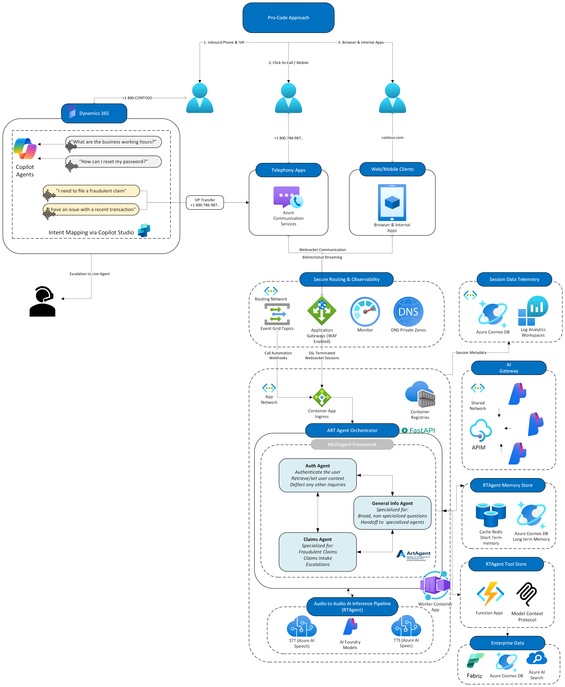

# :material-microsoft-dynamics-365: Dynamics 365 Integration

!!! abstract "Integrating with Microsoft Dynamics 365 via Copilot Studio"
    This guide covers integration between Azure Real-Time Voice Agent and Microsoft Dynamics 365 Customer Service using **Copilot Studio** as the orchestration layer. This architecture enables intelligent call routing where Copilot Studio handles standard conversations, and complex or pro-code scenarios are seamlessly transferred to the Azure Voice Agent for deep conversational control.

---

## :material-sitemap: Integration Architecture

The architecture leverages **Copilot Studio** as the primary conversation manager, with the ability to transfer complex interactions to the Azure Real-Time Voice Agent when advanced capabilities are needed.

---

## :material-lightbulb: Integration Pattern Overview

### **Two-Tier Conversation Strategy**

This integration implements a routing pattern:

**1. Copilot Studio as Primary Layer**

Copilot Studio serves as the first point of contact and handles:

- ✅ **Standard customer conversations** - Common inquiries and FAQs
- ✅ **Low-code/no-code bot configuration** - Quick updates without development
- ✅ **Structured dialog flows** - Predictable conversation paths
- ✅ **Native Dynamics 365 integration** - Direct access to CRM entities
- ✅ **Knowledge base queries** - Search and retrieve documentation

**2. Azure Voice Agent for Complex Scenarios**

When conversations require advanced capabilities, transfer to Azure Voice Agent for:

- 🚀 **Deep conversational control** - Pro-code flexibility with custom logic
- 🚀 **Advanced AI orchestration** - Multi-model strategies with Azure OpenAI
- 🚀 **Multi-agent architectures** - Specialized domain agents (claims, scheduling, insurance)
- 🚀 **Real-time speech processing** - Advanced STT/TTS with Voice Live SDK
- 🚀 **Complex state management** - Session persistence and context tracking
- 🚀 **Custom business integrations** - External APIs, legacy systems, databases

