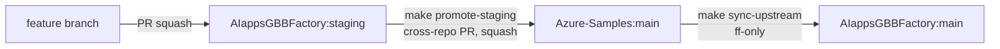

# Release & Sync Workflow

This repo lives in **two GitHub orgs**, and the sync between them is the largest
historical source of commit-history complexity. This document defines the
canonical workflow and is enforced by repo settings and branch protection.

## Repo topology

| Org / Repo                                       | Branch    | Role                                                                                       |
| ------------------------------------------------ | --------- | ------------------------------------------------------------------------------------------ |
| `AIappsGBBFactory/art-voice-agent-accelerator`   | `staging` | Active dev branch. All feature work lands here via PR.                                     |
| `AIappsGBBFactory/art-voice-agent-accelerator`   | `main`    | Tracks `Azure-Samples/main`. Updated only via `make sync-upstream`. Read-only otherwise.   |
| `Azure-Samples/art-voice-agent-accelerator`      | `main`    | Public sample. Updated only via cross-repo PR from `AIappsGBBFactory:staging`, **squashed**. |

## Flow



Only **three** operations move commits between branches:
1. **Feature PR** into `staging` (squash-only, branch auto-deleted).
2. **`make sync-upstream`** — fast-forward `main` from `Azure-Samples/main`.
3. **`make promote-staging`** — open a cross-repo squash PR from `staging` to `Azure-Samples/main`.

## Daily workflow

### Feature work

```bash
git checkout staging
git pull --rebase                                  # never creates a merge bubble
git checkout -b feat/my-feature
# ... commits ...
git push -u origin feat/my-feature
gh pr create --base staging
```

PRs into `staging` are **squash-only**. The PR title becomes the single commit
on `staging`, so write descriptive titles using
[Conventional Commits](https://www.conventionalcommits.org/) (`feat:`, `fix:`,
`chore:`, etc.). The feature branch is auto-deleted on merge.

### Syncing the latest from upstream

Periodically (typically weekly, or before promoting), refresh AIappsGBBFactory
`main` from `Azure-Samples/main`:

```bash
make sync-upstream
```

This performs a **fast-forward-only** merge. If it fails, someone pushed
directly to `AIappsGBBFactory:main` (which branch protection now blocks for
new commits) — the error message tells you how to reconcile.

### Promoting staging to Azure-Samples

When `staging` is ready to publish to the public sample:

```bash
make promote-staging
```

This opens a cross-repo PR from `AIappsGBBFactory:staging` → `Azure-Samples:main`.
**The Azure-Samples maintainer must use "Squash and merge"** — never
"Create a merge commit" — otherwise every commit on `staging` lands verbatim
on the public sample and history pollution recurs.

## One-time setup

### Local git config (every developer)

These two settings prevent `Merge branch X of github.com` bubbles in your
local commits when you fetch from a shared branch:

```bash
git config --global pull.rebase true
git config --global fetch.prune true
```

### Remotes

```bash
git remote add origin git@github.com:AIappsGBBFactory/art-voice-agent-accelerator.git
git remote add Azure-Samples git@github.com:Azure-Samples/art-voice-agent-accelerator.git
git fetch --all
```

## Enforced repo settings

| Setting                              | AIappsGBBFactory | Azure-Samples    | Why                                          |
| ------------------------------------ | ---------------- | ---------------- | -------------------------------------------- |
| `allow_merge_commit`                 | disabled         | (upstream owns)  | Prevents merge bubbles on every PR           |
| `allow_rebase_merge`                 | disabled         | (upstream owns)  | Forces a single commit per PR                |
| `allow_squash_merge`                 | enabled          | enabled          | The only allowed strategy                    |
| `delete_branch_on_merge`             | enabled          | (upstream owns)  | Auto-cleanup                                 |
| `squash_merge_commit_title`          | `PR_TITLE`       | (upstream owns)  | PR title becomes commit subject              |
| `squash_merge_commit_message`        | `PR_BODY`        | (upstream owns)  | PR body becomes commit body                  |
| Branch protection on `staging`/`main`| PR required, linear history, no force-push | (upstream owns) | No direct pushes; no rewrites                |

## Anti-patterns

| Don't                                                  | Do instead                                                              |
| ------------------------------------------------------ | ----------------------------------------------------------------------- |
| `git pull` on a shared branch                          | `git pull --rebase` (set globally — see one-time setup)                 |
| `git merge Azure-Samples/main` directly into `staging` | `make sync-upstream` to refresh `main`, then rebase your feature branch |
| Push directly to `staging` or `main`                   | Open a PR — branch protection enforces this                             |
| Merge a branch from one fork into the other manually   | Use `make promote-staging` for the one canonical direction              |
| Hit **"Create a merge commit"** on a cross-repo PR     | Always **"Squash and merge"**                                           |

## Background — why this exists

A historical audit (Nov 2026) of the cumulative `staging → Azure-Samples:main`
delta found:

- **27** `Merge branch X into Y` bubbles (developers running `git pull` without
  rebase).
- **24** reverse-direction `Merge pull request #N from Azure-Samples/X` commits
  (manual fork-to-fork merges via the GitHub UI).
- **272** direct pushes to `staging` with no associated PR (no branch
  protection in place).

The combined remediation:

| Pollution source              | Fix                                          |
| ----------------------------- | -------------------------------------------- |
| `git pull` bubbles            | Local `pull.rebase=true`                     |
| `Create merge commit` on PR   | Repo setting: `allow_merge_commit=false`     |
| Cross-fork manual merges      | `make promote-staging` is the only path      |
| Direct pushes to `staging`    | Branch protection requires PR                |
| Direct pushes to `main`       | Branch protection + `make sync-upstream`     |
